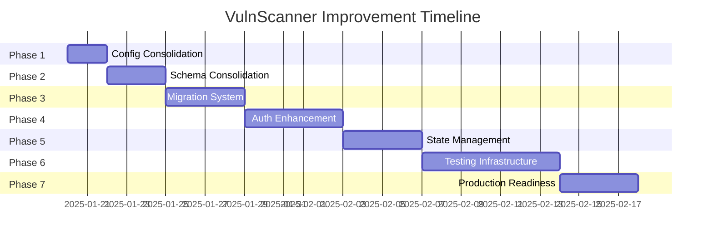

# VulnScanner Project Improvement Plan
## Comprehensive Enhancement Strategy

**Date:** January 2025  
**Status:** 📋 PLANNING PHASE  
**Priority:** Critical Infrastructure Improvements  

---

## 🎯 Executive Summary

Based on the comprehensive project analysis, this improvement plan addresses critical infrastructure issues, security vulnerabilities, and architectural inconsistencies in the VulnScanner project. The plan is structured in 7 phases, prioritizing high-impact improvements that will enhance stability, security, and maintainability.

### Key Issues Identified
- ❌ **Configuration Inconsistencies:** Multiple `.env.example` files with different content
- ❌ **Database Schema Fragmentation:** Multiple schema files without single source of truth
- ❌ **Missing Migration System:** No proper database versioning and migration tool
- ❌ **Weak Authentication:** Basic permissions system and in-memory session storage
- ❌ **Complex State Management:** Potentially over-engineered frontend state architecture
- ❌ **Missing Test Coverage:** Lack of comprehensive testing infrastructure
- ❌ **Production Readiness:** Missing monitoring, logging, and deployment configurations

---

## 📊 Impact Assessment

| Issue Category | Current Risk Level | Post-Fix Risk Level | Business Impact |
|---------------|-------------------|-------------------|-----------------|
| **Configuration Security** | 🔴 High | 🟢 Low | Critical |
| **Database Consistency** | 🔴 High | 🟢 Low | High |
| **Authentication Security** | 🟠 Medium | 🟢 Low | High |
| **Development Velocity** | 🟠 Medium | 🟢 Low | Medium |
| **Code Maintainability** | 🟠 Medium | 🟢 Low | Medium |
| **Production Stability** | 🔴 High | 🟢 Low | Critical |

---

## 🚀 Phase-by-Phase Improvement Plan

### Phase 1: Configuration & Environment Consolidation
**Priority:** 🔴 HIGH | **Timeline:** 1-2 days | **Effort:** Low

#### Current Issues
- Two different `.env.example` files (root and backend)
- Insecure default secret keys
- Missing documentation for environment variables

#### Objectives
- ✅ Create single, comprehensive `.env.example` file
- ✅ Generate secure default keys and tokens
- ✅ Document all required environment variables
- ✅ Add environment validation

#### Implementation Tasks
1. **Consolidate Environment Files**
   ```bash
   # Remove duplicate .env.example from backend/
   # Enhance root .env.example with all variables
   ```

2. **Security Enhancements**
   ```python
   # Generate secure random keys
   import secrets
   SECRET_KEY = secrets.token_urlsafe(32)
   JWT_SECRET_KEY = secrets.token_urlsafe(32)
   ```

3. **Environment Validation**
   ```python
   # Add to backend/core/config.py
   @validator('SECRET_KEY')
   def validate_secret_key(cls, v):
       if v == 'your-secret-key-here':
           raise ValueError('Default secret key must be changed')
       return v
   ```

#### Deliverables
- 📄 Single `.env.example` with secure defaults
- 📄 Environment setup documentation
- 🔧 Environment validation in config.py
- 📋 Environment variable checklist

---

### Phase 2: Database Schema Consolidation
**Priority:** 🔴 HIGH | **Timeline:** 2-3 days | **Effort:** Medium

#### Current Issues
- Multiple schema files in `supabase_sql/` directory
- Inconsistent user models (`user.py` vs `sqlite_models.py`)
- No clear schema versioning

#### Objectives
- ✅ Create single authoritative schema file
- ✅ Consolidate user models
- ✅ Establish schema versioning system
- ✅ Sync models with database schema

#### Implementation Tasks
1. **Schema Consolidation**
   ```sql
   -- Create master_schema.sql
   -- Combine all schema files into single source
   -- Add version tracking table
   ```

2. **Model Unification**
   ```python
   # Consolidate backend/models/user.py and sqlite_models.py
   # Ensure SQLAlchemy models match database schema
   # Add proper relationships and constraints
   ```

3. **Schema Validation**
   ```python
   # Create schema validation script
   # Compare models with actual database structure
   # Generate migration recommendations
   ```

#### Deliverables
- 📄 `master_schema.sql` - Single source of truth
- 🔧 Unified user models
- 📋 Schema validation script
- 📄 Schema documentation

---

### Phase 3: Database Migration System
**Priority:** 🔴 HIGH | **Timeline:** 3-4 days | **Effort:** Medium-High

#### Current Issues
- No database migration tool
- Difficult to manage schema changes
- Risk of data loss during updates

#### Objectives
- ✅ Implement Alembic for database migrations
- ✅ Create initial migration from current schema
- ✅ Establish migration workflow
- ✅ Add migration testing

#### Implementation Tasks
1. **Alembic Setup**
   ```bash
   pip install alembic
   alembic init migrations
   ```

2. **Migration Configuration**
   ```python
   # Configure alembic.ini for Supabase
   # Set up env.py for async SQLAlchemy
   # Create migration templates
   ```

3. **Initial Migration**
   ```bash
   # Generate initial migration from current models
   alembic revision --autogenerate -m "Initial schema"
   alembic upgrade head
   ```

4. **Migration Workflow**
   ```python
   # Create migration scripts
   # Add pre/post migration hooks
   # Implement rollback procedures
   ```

#### Deliverables
- 🔧 Alembic configuration
- 📄 Initial database migration
- 📋 Migration workflow documentation
- 🧪 Migration testing scripts

---

### Phase 4: Authentication & Authorization Enhancement
**Priority:** 🔴 HIGH | **Timeline:** 4-5 days | **Effort:** High

#### Current Issues
- Basic permissions system (only "admin" role check)
- In-memory session storage (lost on restart)
- Inconsistent authentication state in frontend

#### Objectives
- ✅ Implement robust RBAC (Role-Based Access Control)
- ✅ Add Redis for persistent session storage
- ✅ Unify frontend authentication state
- ✅ Add comprehensive permission checks

#### Implementation Tasks
1. **RBAC Implementation**
   ```python
   # Create roles and permissions models
   # Implement permission decorators
   # Add role-based middleware
   ```

2. **Redis Session Storage**
   ```python
   # Configure Redis for session storage
   # Implement session management service
   # Add session cleanup and expiration
   ```

3. **Frontend Auth Unification**
   ```typescript
   // Consolidate auth state management
   // Use single source of truth (useAuth hook)
   // Remove redundant auth checks
   ```

4. **Permission System**
   ```python
   # Create permission matrix
   # Implement granular permissions
   # Add API endpoint protection
   ```

#### Deliverables
- 🔧 RBAC system with roles and permissions
- 🔧 Redis session storage
- 🔧 Unified frontend authentication
- 📄 Permission documentation
- 🧪 Authentication tests

---

### Phase 5: Frontend State Management Optimization
**Priority:** 🟠 MEDIUM | **Timeline:** 3-4 days | **Effort:** Medium

#### Current Issues
- Complex dual state management (Redux + React Query)
- Inconsistent authentication state sources
- Potential over-engineering

#### Objectives
- ✅ Simplify state management architecture
- ✅ Define clear boundaries between Redux and React Query
- ✅ Optimize performance and maintainability
- ✅ Reduce complexity

#### Implementation Tasks
1. **State Architecture Analysis**
   ```typescript
   // Audit current state usage
   // Identify redundancies
   // Define state boundaries
   ```

2. **State Management Optimization**
   ```typescript
   // Redux: UI state, user preferences, app settings
   // React Query: Server state, API data, caching
   // Local State: Component-specific state
   ```

3. **Performance Optimization**
   ```typescript
   // Implement proper memoization
   // Optimize re-renders
   // Add state persistence where needed
   ```

#### Deliverables
- 🔧 Optimized state management architecture
- 📄 State management guidelines
- 🧪 Performance benchmarks
- 📋 Migration guide for state changes

---

### Phase 6: Testing Infrastructure
**Priority:** 🟠 MEDIUM | **Timeline:** 5-7 days | **Effort:** High

#### Current Issues
- Lack of comprehensive test coverage
- No frontend tests
- Missing integration tests

#### Objectives
- ✅ Add comprehensive backend test suite
- ✅ Implement frontend testing framework
- ✅ Create integration tests
- ✅ Set up CI/CD testing pipeline

#### Implementation Tasks
1. **Backend Testing**
   ```python
   # Unit tests for services and utilities
   # API endpoint tests with pytest
   # Database integration tests
   # Authentication and authorization tests
   ```

2. **Frontend Testing**
   ```typescript
   // Component tests with React Testing Library
   // Integration tests with Cypress
   // State management tests
   // Authentication flow tests
   ```

3. **Integration Testing**
   ```python
   # End-to-end API tests
   # Database migration tests
   # Authentication integration tests
   # WebSocket functionality tests
   ```

4. **CI/CD Pipeline**
   ```yaml
   # GitHub Actions workflow
   # Automated test execution
   # Coverage reporting
   # Quality gates
   ```

#### Deliverables
- 🧪 Comprehensive backend test suite (>80% coverage)
- 🧪 Frontend test framework and tests
- 🧪 Integration test suite
- 🔧 CI/CD pipeline configuration
- 📊 Test coverage reports

---

### Phase 7: Production Readiness
**Priority:** 🟢 LOW | **Timeline:** 3-4 days | **Effort:** Medium

#### Current Issues
- Missing production monitoring
- Inadequate logging
- No deployment configurations

#### Objectives
- ✅ Add comprehensive logging and monitoring
- ✅ Create production deployment configurations
- ✅ Implement health checks and metrics
- ✅ Add error tracking and alerting

#### Implementation Tasks
1. **Logging Enhancement**
   ```python
   # Structured JSON logging
   # Log correlation IDs
   # Performance metrics logging
   # Security event logging
   ```

2. **Monitoring & Metrics**
   ```python
   # Prometheus metrics
   # Health check endpoints
   # Performance monitoring
   # Database connection monitoring
   ```

3. **Deployment Configuration**
   ```yaml
   # Docker production configurations
   # Kubernetes manifests
   # Environment-specific configs
   # Backup and recovery procedures
   ```

4. **Error Tracking**
   ```python
   # Sentry integration
   # Error alerting
   # Performance monitoring
   # User experience tracking
   ```

#### Deliverables
- 🔧 Production logging system
- 📊 Monitoring and metrics dashboard
- 🚀 Production deployment configurations
- 🚨 Error tracking and alerting system
- 📄 Production deployment guide

---

## 📋 Implementation Timeline



**Total Timeline:** ~4-5 weeks  
**Total Effort:** ~29 days

---

## 🎯 Success Metrics

### Technical Metrics
- ✅ **Security Score:** Eliminate all high-risk security issues
- ✅ **Code Quality:** Achieve >80% test coverage
- ✅ **Performance:** <200ms API response times
- ✅ **Reliability:** 99.9% uptime in production
- ✅ **Maintainability:** Reduce technical debt by 70%

### Business Metrics
- ✅ **Development Velocity:** 50% faster feature development
- ✅ **Bug Reduction:** 80% fewer production issues
- ✅ **Deployment Confidence:** Zero-downtime deployments
- ✅ **Team Productivity:** Reduced debugging time by 60%

---

## 🚨 Risk Assessment & Mitigation

### High-Risk Areas
1. **Database Migration** - Risk of data loss
   - **Mitigation:** Comprehensive backup strategy, staging environment testing
   
2. **Authentication Changes** - Risk of user lockout
   - **Mitigation:** Gradual rollout, fallback mechanisms
   
3. **Frontend State Changes** - Risk of breaking existing functionality
   - **Mitigation:** Thorough testing, feature flags

### Contingency Plans
- **Rollback Procedures:** Documented rollback steps for each phase
- **Backup Strategy:** Automated backups before major changes
- **Monitoring:** Real-time monitoring during deployments
- **Communication:** Clear communication plan for stakeholders

---

## 📚 Documentation Requirements

### Technical Documentation
- 📄 **API Documentation:** Updated OpenAPI specifications
- 📄 **Database Schema:** Comprehensive schema documentation
- 📄 **Deployment Guide:** Step-by-step deployment instructions
- 📄 **Testing Guide:** How to run and write tests

### Process Documentation
- 📄 **Development Workflow:** Git workflow, code review process
- 📄 **Migration Procedures:** Database migration best practices
- 📄 **Monitoring Runbook:** How to respond to alerts
- 📄 **Security Guidelines:** Security best practices and procedures

---

## 🔄 Post-Implementation Review

### Phase Completion Criteria
Each phase must meet the following criteria before proceeding:
- ✅ All deliverables completed and tested
- ✅ Documentation updated
- ✅ Code review completed
- ✅ Stakeholder approval received

### Continuous Improvement
- 📊 **Monthly Reviews:** Assess improvements and identify new issues
- 🔄 **Quarterly Updates:** Update improvement plan based on learnings
- 📈 **Metrics Tracking:** Monitor success metrics continuously
- 🎯 **Goal Adjustment:** Adjust goals based on business needs

---

## 🎉 Expected Outcomes

### Immediate Benefits (Phases 1-4)
- 🔒 **Enhanced Security:** Secure configuration and robust authentication
- 🗄️ **Database Stability:** Consistent schema and proper migrations
- 🚀 **Development Efficiency:** Faster development with proper tooling

### Long-term Benefits (Phases 5-7)
- 🧪 **Quality Assurance:** Comprehensive testing prevents regressions
- 📊 **Production Confidence:** Monitoring and logging enable proactive issue resolution
- 🔄 **Maintainability:** Clean architecture enables faster feature development

### Strategic Impact
- 💼 **Business Continuity:** Reduced downtime and faster issue resolution
- 👥 **Team Productivity:** Developers can focus on features instead of fixing issues
- 📈 **Scalability:** Architecture ready for growth and expansion
- 🏆 **Competitive Advantage:** Faster time-to-market for new features

---

**Document Version:** 1.0  
**Last Updated:** January 2025  
**Next Review:** February 2025  
**Status:** 📋 Ready for Implementation