# 🛡️ VulnScanner

<div align="center">


**AI-Powered URL Threat Intelligence & Vulnerability Analysis Platform**

[](/)
[](https://nextjs.org/)
[](https://www.fastify.io/)
[](https://www.typescriptlang.org/)
[](https://supabase.com/)
[](https://playwright.dev/)

[Features](#-key-features) • [Quick Start](#-quick-start) • [Documentation](#-documentation) • [Architecture](#-system-architecture) • [API](#-api-reference)

</div>

---

## 📋 Table of Contents

1. [Executive Summary](#-executive-summary)
2. [Key Features](#-key-features)
3. [Quick Start](#-quick-start)
4. [System Architecture](#-system-architecture)
5. [Technology Stack](#-technology-stack)
6. [Project Structure](#-project-structure)
7. [Database Design](#-database-design)
8. [Authentication & Security](#-authentication--security)
9. [Scanning Engine](#-scanning-engine)
10. [Frontend Architecture](#-frontend-architecture)
11. [API Reference](#-api-reference)
12. [Real-Time Features](#-real-time-features)
13. [Deployment](#-deployment)
14. [User Guide](#-user-guide)
15. [Configuration](#-configuration)
16. [Testing](#-testing)
17. [Troubleshooting](#-troubleshooting)
18. [FAQ](#-faq)
19. [Roadmap](#-roadmap)
20. [Contributing](#-contributing)
21. [License](#-license)

---

## 📊 Executive Summary

### What is VulnScanner?

VulnScanner is a comprehensive, enterprise-grade security analysis platform designed to help organizations identify, track, and remediate web application vulnerabilities. The platform combines advanced web crawling technology with intelligent vulnerability detection to provide actionable security insights.

Unlike traditional vulnerability scanners that require complex setup and specialized knowledge, VulnScanner was built with a **"security for everyone"** philosophy. The platform abstracts the complexity of security scanning behind an intuitive dashboard, making professional-grade security analysis accessible to development teams of all skill levels.

### Core Value Proposition

| Challenge | VulnScanner Solution |
|-----------|---------------------|
| **Accessibility Gap** | Clear, actionable findings with remediation guidance that any developer can understand |
| **Continuous Monitoring** | Scheduled scans and continuous monitoring integrated into the development lifecycle |
| **Real-Time Visibility** | Live console output, real-time progress tracking, and instant notifications |

### Production Readiness Score

```
┌─────────────────────────────────────────────────────────────────────────────┐
│  Category                     │ Status          │ Score  │ Severity        │
├───────────────────────────────┼─────────────────┼────────┼─────────────────┤
│  Security                     │ ✅ Good         │ 80/100 │ HIGH            │
│  Authentication & AuthZ       │ ✅ Excellent    │ 90/100 │ HIGH            │
│  Error Handling               │ ✅ Good         │ 80/100 │ MEDIUM          │
│  Testing                      │ ✅ Good         │ 75/100 │ MEDIUM          │
│  Logging & Monitoring         │ ✅ Good         │ 85/100 │ MEDIUM          │
│  Configuration Management     │ ✅ Excellent    │ 90/100 │ LOW             │
│  API Design & Validation      │ ✅ Good         │ 85/100 │ LOW             │
│  Database & Data Layer        │ ✅ Excellent    │ 90/100 │ LOW             │
│  Performance                  │ ⚠️ Basic        │ 65/100 │ MEDIUM          │
│  Deployment Infrastructure    │ ✅ Good         │ 85/100 │ LOW             │
├───────────────────────────────┼─────────────────┼────────┼─────────────────┤
│  OVERALL SCORE                │ ✅ READY        │ 85/100 │                 │
└─────────────────────────────────────────────────────────────────────────────┘
```

---

## ✨ Key Features

- 🔍 **Deep URL Analysis** - Crawl websites and analyze pages for security vulnerabilities
- 🎯 **Threat Detection** - Identify XSS, SQL injection, insecure headers, and more
- 📡 **Real-time Progress** - Live updates during scan execution via WebSockets
- 🔐 **Multi-Factor Authentication** - TOTP-based authenticator app support with email fallback
- 📊 **Executive Dashboard** - Overview of security posture across all projects
- ⏰ **Scheduled Scans** - Cron-based automated scanning
- 🐳 **Docker Ready** - Production-ready containerization
- 📱 **Responsive Design** - Works on desktop and mobile devices

---

## 🚀 Quick Start

### Prerequisites

- Node.js 18+ 
- npm or yarn
- Docker (optional, for containerized deployment)

### Installation

```bash
# Clone the repository
git clone https://github.com/krishna0605/vulnscanner.git
cd vulnscanner

# Install root dependencies
npm install

# Install frontend dependencies
cd frontend && npm install && cd ..

# Install backend dependencies
cd backend && npm install && cd ..
```

### Environment Setup

Create `.env` files in both `frontend` and `backend` directories:

**Backend `.env`:**
```env
SUPABASE_URL=your_supabase_url
SUPABASE_SERVICE_ROLE_KEY=your_service_role_key
PORT=3001
NODE_ENV=development
LOG_LEVEL=info
ALLOWED_ORIGINS=http://localhost:3000
```

**Frontend `.env.local`:**
```env
NEXT_PUBLIC_SUPABASE_URL=your_supabase_url
NEXT_PUBLIC_SUPABASE_ANON_KEY=your_anon_key
BACKEND_URL=http://localhost:3001
```

### Running the Application

```bash
# Terminal 1: Start Backend
cd backend && npm run dev

# Terminal 2: Start Frontend
cd frontend && npm run dev
```

**Access Points:**
- Frontend: http://localhost:3000
- Backend API: http://localhost:3001
- API Docs: http://localhost:3001/docs

### Docker Quick Start

```bash
docker-compose up --build
```

---

## 🏗️ System Architecture

### High-Level Architecture

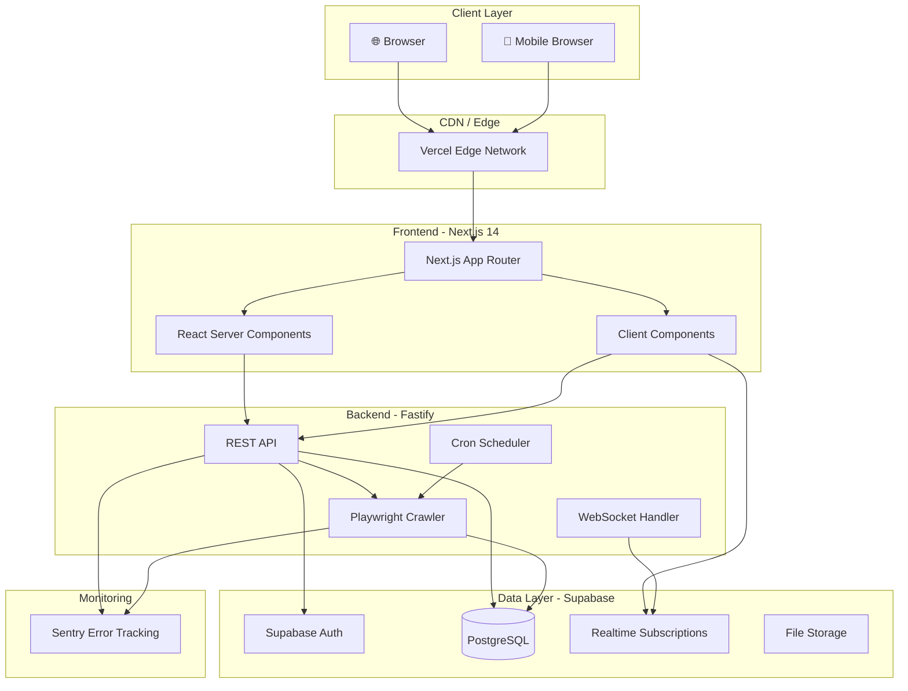
```mermaid
graph TB
    subgraph "Client Layer"
        Browser[🌐 Browser]
        Mobile[📱 Mobile Browser]
    end
    
    subgraph "CDN / Edge"
        Vercel[Vercel Edge Network]
    end
    
    subgraph "Frontend - Next.js 14"
        NextApp[Next.js App Router]
        RSC[React Server Components]
        ClientComp[Client Components]
    end
    
    subgraph "Backend - Fastify"
        API[REST API]
        WS[WebSocket Handler]
        Crawler[Playwright Crawler]
        Scheduler[Cron Scheduler]
    end
    
    subgraph "Data Layer - Supabase"
        Auth[Supabase Auth]
        DB[(PostgreSQL)]
        Realtime[Realtime Subscriptions]
        Storage[File Storage]
    end
    
    subgraph "Monitoring"
        Sentry[Sentry Error Tracking]
    end
    
    Browser --> Vercel
    Mobile --> Vercel
    Vercel --> NextApp
    NextApp --> RSC
    NextApp --> ClientComp
    RSC --> API
    ClientComp --> API
    ClientComp --> Realtime
    API --> Auth
    API --> DB
    API --> Crawler
    Scheduler --> Crawler
    Crawler --> DB
    WS --> Realtime
    API --> Sentry
    Crawler --> Sentry
```

### Layered Architecture

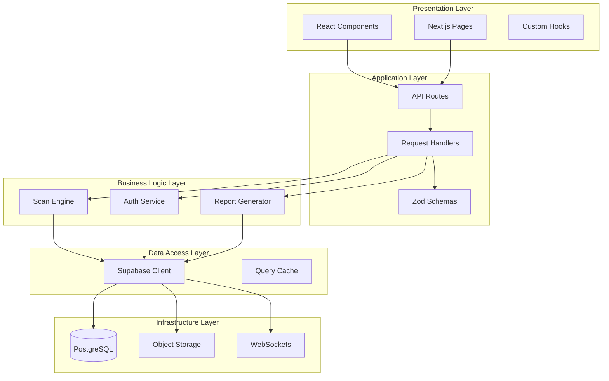
```mermaid
graph TB
    subgraph "Presentation Layer"
        UI[React Components]
        Pages[Next.js Pages]
        Hooks[Custom Hooks]
    end
    
    subgraph "Application Layer"
        Routes[API Routes]
        Controllers[Request Handlers]
        Validators[Zod Schemas]
    end
    
    subgraph "Business Logic Layer"
        Scanner[Scan Engine]
        Auth[Auth Service]
        Reports[Report Generator]
    end
    
    subgraph "Data Access Layer"
        Supabase[Supabase Client]
        Cache[Query Cache]
    end
    
    subgraph "Infrastructure Layer"
        DB[(PostgreSQL)]
        Storage[Object Storage]
        Realtime[WebSockets]
    end
    
    UI --> Routes
    Pages --> Routes
    Routes --> Controllers
    Controllers --> Validators
    Controllers --> Scanner
    Controllers --> Auth
    Controllers --> Reports
    Scanner --> Supabase
    Auth --> Supabase
    Reports --> Supabase
    Supabase --> DB
    Supabase --> Storage
    Supabase --> Realtime
```

### Component Interaction

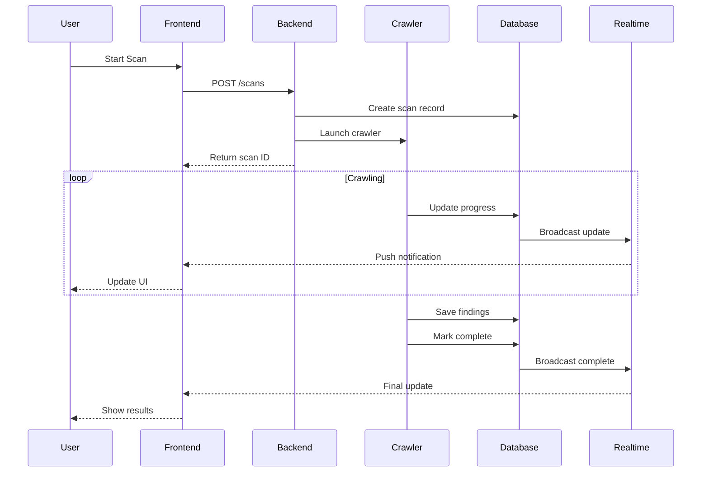
```mermaid
sequenceDiagram
    participant U as User
    participant F as Frontend
    participant B as Backend
    participant C as Crawler
    participant D as Database
    participant R as Realtime
    
    U->>F: Start Scan
    F->>B: POST /scans
    B->>D: Create scan record
    B->>C: Launch crawler
    B-->>F: Return scan ID
    
    loop Crawling
        C->>D: Update progress
        D->>R: Broadcast update
        R-->>F: Push notification
        F-->>U: Update UI
    end
    
    C->>D: Save findings
    C->>D: Mark complete
    D->>R: Broadcast complete
    R-->>F: Final update
    F-->>U: Show results
```

---

## 💻 Technology Stack

### Technology Overview

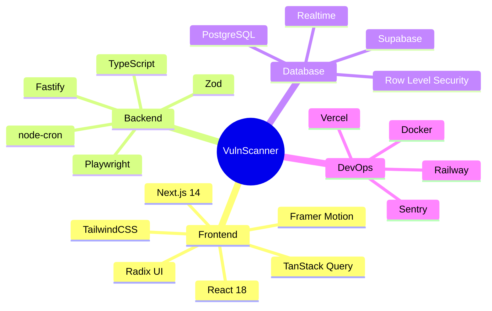
```mermaid
mindmap
  root((VulnScanner))
    Frontend
      Next.js 14
      React 18
      TailwindCSS
      Radix UI
      TanStack Query
      Framer Motion
    Backend
      Fastify
      TypeScript
      Playwright
      Zod
      node-cron
    Database
      Supabase
      PostgreSQL
      Row Level Security
      Realtime
    DevOps
      Docker
      Vercel
      Railway
      Sentry
```

### Detailed Stack

| Layer | Technology | Version | Purpose |
|-------|------------|---------|---------|
| **Frontend Framework** | Next.js | 14.2.14 | React framework with App Router |
| **UI Library** | React | 18.3.1 | Component library |
| **Styling** | TailwindCSS | 3.4.1 | Utility-first CSS |
| **UI Components** | Radix UI | Various | Accessible component primitives |
| **Animations** | Framer Motion | 12.29.2 | Animation library |
| **State Management** | TanStack Query | 5.24.0 | Server state management |
| **Charts** | Recharts | 3.7.0 | Data visualization |
| **Backend Framework** | Fastify | 4.26.1 | High-performance Node.js framework |
| **Language** | TypeScript | 5.3.3 | Type-safe JavaScript |
| **Web Crawler** | Playwright | 1.58.0 | Browser automation |
| **Validation** | Zod | 3.22.4 | Schema validation |
| **Scheduler** | node-cron | 4.2.1 | Cron job scheduling |
| **Database** | Supabase (PostgreSQL) | Latest | Database + Auth + Storage |
| **Error Monitoring** | Sentry | 10.38.0 | Error tracking |

---

## 📁 Project Structure

### Directory Structure

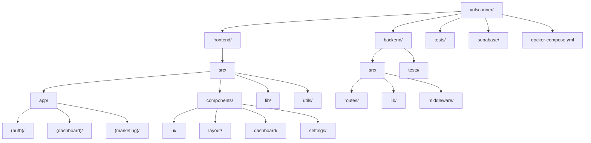
```mermaid
graph TD
    Root[vulscanner/]
    
    Root --> Frontend[frontend/]
    Root --> Backend[backend/]
    Root --> Tests[tests/]
    Root --> Supabase[supabase/]
    Root --> Docker[docker-compose.yml]
    
    Frontend --> FrontSrc[src/]
    FrontSrc --> App[app/]
    FrontSrc --> Components[components/]
    FrontSrc --> Lib[lib/]
    FrontSrc --> Utils[utils/]
    
    App --> Auth["(auth)/"]
    App --> Dashboard["(dashboard)/"]
    App --> Marketing["(marketing)/"]
    
    Components --> UI[ui/]
    Components --> Layout[layout/]
    Components --> DashComp[dashboard/]
    Components --> Settings[settings/]
    
    Backend --> BackSrc[src/]
    BackSrc --> Routes[routes/]
    BackSrc --> BackLib[lib/]
    BackSrc --> Middleware[middleware/]
    
    Backend --> BackTests[tests/]
```

### Detailed Structure

```
vulscanner/
├── 📁 frontend/                 # Next.js 14 Application
│   ├── 📁 src/
│   │   ├── 📁 app/             # App Router Pages
│   │   │   ├── 📁 (auth)/      # Login, Signup, MFA, Verify-2FA
│   │   │   ├── 📁 (dashboard)/ # Dashboard, Projects, Scans, Reports
│   │   │   └── 📁 (marketing)/ # Landing Page, Features, Services
│   │   ├── 📁 components/      # React Components (64+ files)
│   │   │   ├── 📁 ui/          # Base UI (Button, Card, Dialog)
│   │   │   ├── 📁 layout/      # Header, Footer, Sidebar
│   │   │   ├── 📁 dashboard/   # Dashboard widgets
│   │   │   └── 📁 settings/    # Settings sections
│   │   ├── 📁 lib/             # API Fetchers & Utilities
│   │   └── 📁 utils/           # Helper Functions
│   └── 📄 Dockerfile           # Production Build
│
├── 📁 backend/                  # Fastify API Server
│   ├── 📁 src/
│   │   ├── 📁 routes/          # API Endpoints
│   │   │   ├── 📄 scans.ts     # Scan CRUD & Execution
│   │   │   ├── 📄 projects.ts  # Project Management
│   │   │   ├── 📄 profiles.ts  # User Profiles
│   │   │   └── 📄 mfa.ts       # MFA Endpoints
│   │   ├── 📁 lib/             # Core Services
│   │   │   ├── 📄 crawler.ts   # Playwright Web Crawler
│   │   │   ├── 📄 scheduler.ts # Cron Job Manager
│   │   │   ├── 📄 sentry.ts    # Error Monitoring
│   │   │   ├── 📄 env.ts       # Zod Environment Validation
│   │   │   └── 📄 sanitize.ts  # Input Sanitization
│   │   └── 📁 middleware/      # Auth & Request Handling
│   ├── 📁 tests/               # Jest Unit Tests
│   └── 📄 Dockerfile           # Production Build
│
├── 📁 tests/                    # E2E Playwright Tests
├── 📁 supabase/                 # Database Migrations (30+ files)
├── 📄 docker-compose.yml        # Local Development
├── 📄 playwright.config.ts      # E2E Test Configuration
└── 📄 railway.toml              # Railway Deployment Config
```

---

## 🗄️ Database Design

### Entity Relationship Diagram

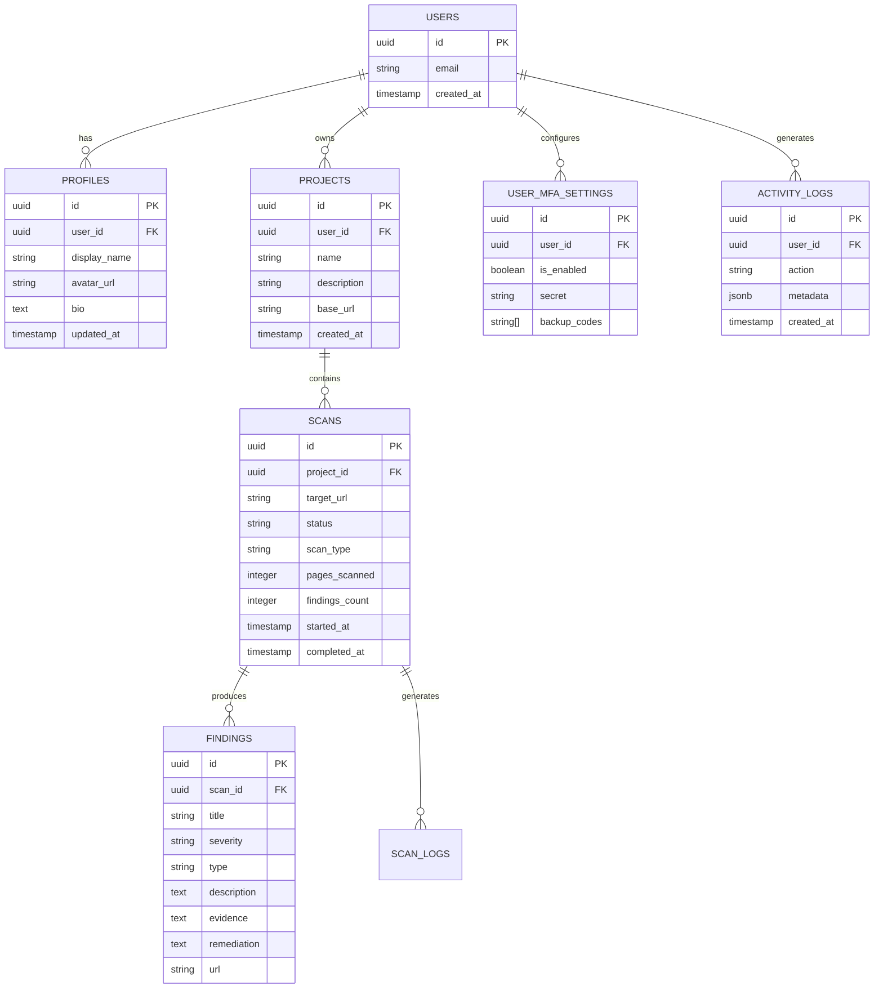
```mermaid
erDiagram
    USERS ||--o{ PROFILES : has
    USERS ||--o{ PROJECTS : owns
    USERS ||--o{ USER_MFA_SETTINGS : configures
    USERS ||--o{ ACTIVITY_LOGS : generates
    
    PROJECTS ||--o{ SCANS : contains
    
    SCANS ||--o{ FINDINGS : produces
    SCANS ||--o{ SCAN_LOGS : generates
    
    USERS {
        uuid id PK
        string email
        timestamp created_at
    }
    
    PROFILES {
        uuid id PK
        uuid user_id FK
        string display_name
        string avatar_url
        text bio
        timestamp updated_at
    }
    
    PROJECTS {
        uuid id PK
        uuid user_id FK
        string name
        string description
        string base_url
        timestamp created_at
    }
    
    SCANS {
        uuid id PK
        uuid project_id FK
        string target_url
        string status
        string scan_type
        integer pages_scanned
        integer findings_count
        timestamp started_at
        timestamp completed_at
    }
    
    FINDINGS {
        uuid id PK
        uuid scan_id FK
        string title
        string severity
        string type
        text description
        text evidence
        text remediation
        string url
    }
    
    USER_MFA_SETTINGS {
        uuid id PK
        uuid user_id FK
        boolean is_enabled
        string secret
        string[] backup_codes
    }
    
    ACTIVITY_LOGS {
        uuid id PK
        uuid user_id FK
        string action
        jsonb metadata
        timestamp created_at
    }
```

### Table Relationships

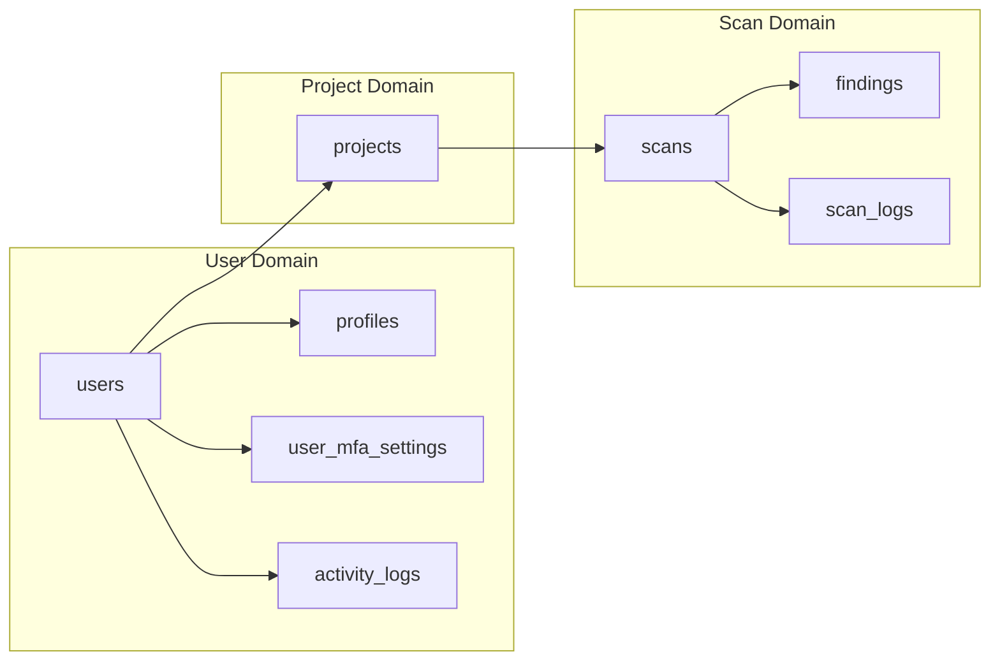
```mermaid
graph LR
    subgraph "User Domain"
        Users[users]
        Profiles[profiles]
        MFA[user_mfa_settings]
        Activity[activity_logs]
    end
    
    subgraph "Project Domain"
        Projects[projects]
    end
    
    subgraph "Scan Domain"
        Scans[scans]
        Findings[findings]
        Logs[scan_logs]
    end
    
    Users --> Profiles
    Users --> MFA
    Users --> Activity
    Users --> Projects
    Projects --> Scans
    Scans --> Findings
    Scans --> Logs
```

### Row Level Security (RLS)

| Table | RLS Enabled | Policy Description |
|-------|-------------|---------------------|
| `profiles` | ✅ | Users can only view/update their own profile |
| `projects` | ✅ | Full CRUD only on own projects |
| `scans` | ✅ | Access via project ownership |
| `findings` | ✅ | Access via project ownership |
| `activity_logs` | ✅ | View/Insert own logs only |
| `user_mfa_settings` | ✅ | Users manage their own MFA |

---

## 🔐 Authentication & Security

### Authentication Flow

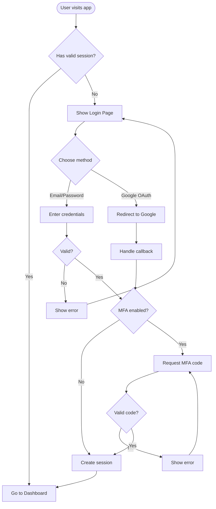
```mermaid
flowchart TD
    Start([User visits app]) --> CheckAuth{Has valid session?}
    
    CheckAuth -->|Yes| Dashboard[Go to Dashboard]
    CheckAuth -->|No| Login[Show Login Page]
    
    Login --> AuthMethod{Choose method}
    
    AuthMethod -->|Email/Password| EmailAuth[Enter credentials]
    AuthMethod -->|Google OAuth| GoogleAuth[Redirect to Google]
    
    EmailAuth --> ValidateCreds{Valid?}
    GoogleAuth --> GoogleCallback[Handle callback]
    
    ValidateCreds -->|No| ShowError[Show error]
    ShowError --> Login
    
    ValidateCreds -->|Yes| CheckMFA{MFA enabled?}
    GoogleCallback --> CheckMFA
    
    CheckMFA -->|No| CreateSession[Create session]
    CheckMFA -->|Yes| MFAPrompt[Request MFA code]
    
    MFAPrompt --> VerifyMFA{Valid code?}
    VerifyMFA -->|No| MFAError[Show error]
    MFAError --> MFAPrompt
    VerifyMFA -->|Yes| CreateSession
    
    CreateSession --> Dashboard
```

### MFA Authentication Flow

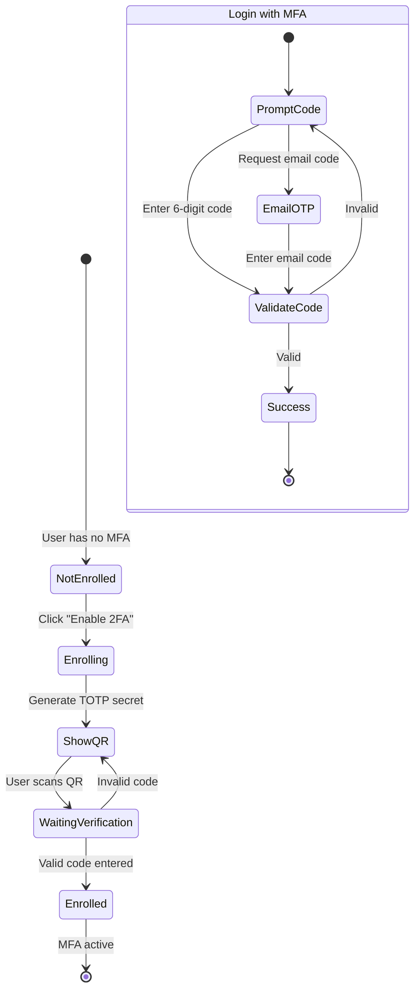
```mermaid
stateDiagram-v2
    [*] --> NotEnrolled: User has no MFA
    
    NotEnrolled --> Enrolling: Click "Enable 2FA"
    Enrolling --> ShowQR: Generate TOTP secret
    ShowQR --> WaitingVerification: User scans QR
    WaitingVerification --> Enrolled: Valid code entered
    WaitingVerification --> ShowQR: Invalid code
    
    Enrolled --> [*]: MFA active
    
    state "Login with MFA" as LoginMFA {
        [*] --> PromptCode
        PromptCode --> ValidateCode: Enter 6-digit code
        ValidateCode --> Success: Valid
        ValidateCode --> PromptCode: Invalid
        PromptCode --> EmailOTP: Request email code
        EmailOTP --> ValidateCode: Enter email code
        Success --> [*]
    }
```

### 2FA Setup Sequence

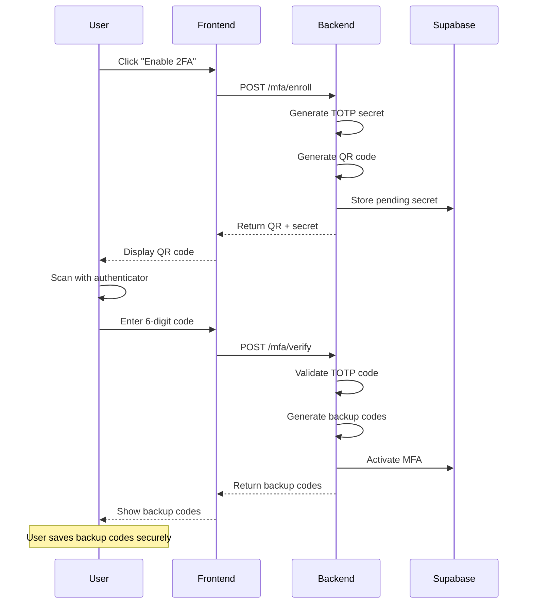
```mermaid
sequenceDiagram
    participant U as User
    participant F as Frontend
    participant B as Backend
    participant S as Supabase
    
    U->>F: Click "Enable 2FA"
    F->>B: POST /mfa/enroll
    B->>B: Generate TOTP secret
    B->>B: Generate QR code
    B->>S: Store pending secret
    B-->>F: Return QR + secret
    F-->>U: Display QR code
    
    U->>U: Scan with authenticator
    U->>F: Enter 6-digit code
    F->>B: POST /mfa/verify
    B->>B: Validate TOTP code
    B->>B: Generate backup codes
    B->>S: Activate MFA
    B-->>F: Return backup codes
    F-->>U: Show backup codes
    
    Note over U: User saves backup codes securely
```

### Google OAuth Flow

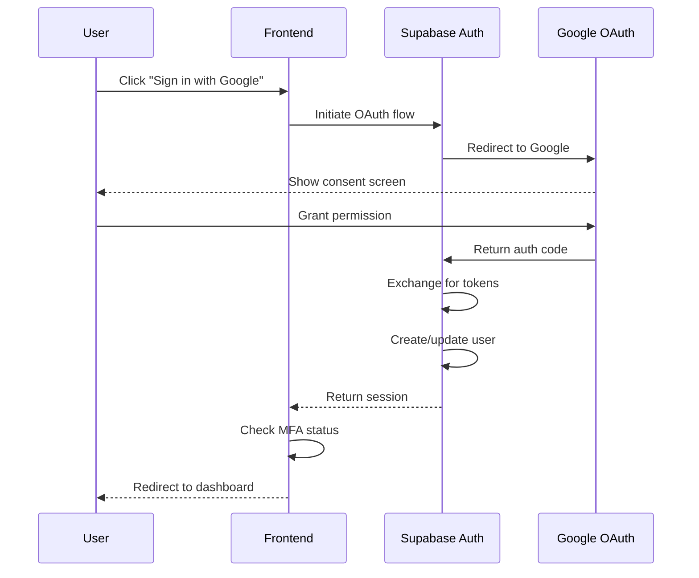
```mermaid
sequenceDiagram
    participant U as User
    participant F as Frontend
    participant S as Supabase Auth
    participant G as Google OAuth
    
    U->>F: Click "Sign in with Google"
    F->>S: Initiate OAuth flow
    S->>G: Redirect to Google
    G-->>U: Show consent screen
    U->>G: Grant permission
    G->>S: Return auth code
    S->>S: Exchange for tokens
    S->>S: Create/update user
    S-->>F: Return session
    F->>F: Check MFA status
    F-->>U: Redirect to dashboard
```

### Security Layers

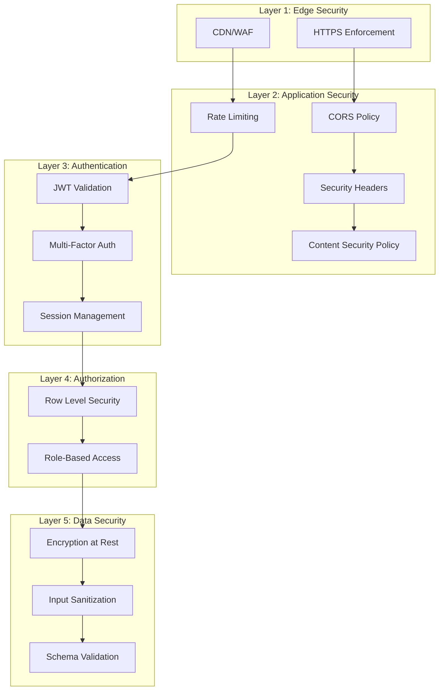
```mermaid
graph TB
    subgraph "Layer 1: Edge Security"
        CDN[CDN/WAF]
        HTTPS[HTTPS Enforcement]
    end
    
    subgraph "Layer 2: Application Security"
        RateLimit[Rate Limiting]
        CORS[CORS Policy]
        Headers[Security Headers]
        CSP[Content Security Policy]
    end
    
    subgraph "Layer 3: Authentication"
        JWT[JWT Validation]
        MFA[Multi-Factor Auth]
        Session[Session Management]
    end
    
    subgraph "Layer 4: Authorization"
        RLS[Row Level Security]
        RBAC[Role-Based Access]
    end
    
    subgraph "Layer 5: Data Security"
        Encryption[Encryption at Rest]
        Sanitization[Input Sanitization]
        Validation[Schema Validation]
    end
    
    CDN --> RateLimit
    HTTPS --> CORS
    RateLimit --> JWT
    CORS --> Headers
    Headers --> CSP
    JWT --> MFA
    MFA --> Session
    Session --> RLS
    RLS --> RBAC
    RBAC --> Encryption
    Encryption --> Sanitization
    Sanitization --> Validation
```

### Security Headers

| Header | Value | Purpose |
|--------|-------|---------|
| `X-Frame-Options` | DENY | Prevents clickjacking |
| `X-Content-Type-Options` | nosniff | Prevents MIME sniffing |
| `X-XSS-Protection` | 1; mode=block | XSS protection |
| `Referrer-Policy` | strict-origin-when-cross-origin | Privacy protection |
| `Permissions-Policy` | camera=(), microphone=(), geolocation=() | Feature restrictions |
| `Content-Security-Policy` | Comprehensive policy | XSS/injection protection |

---

## 🔍 Scanning Engine

### Scan Lifecycle

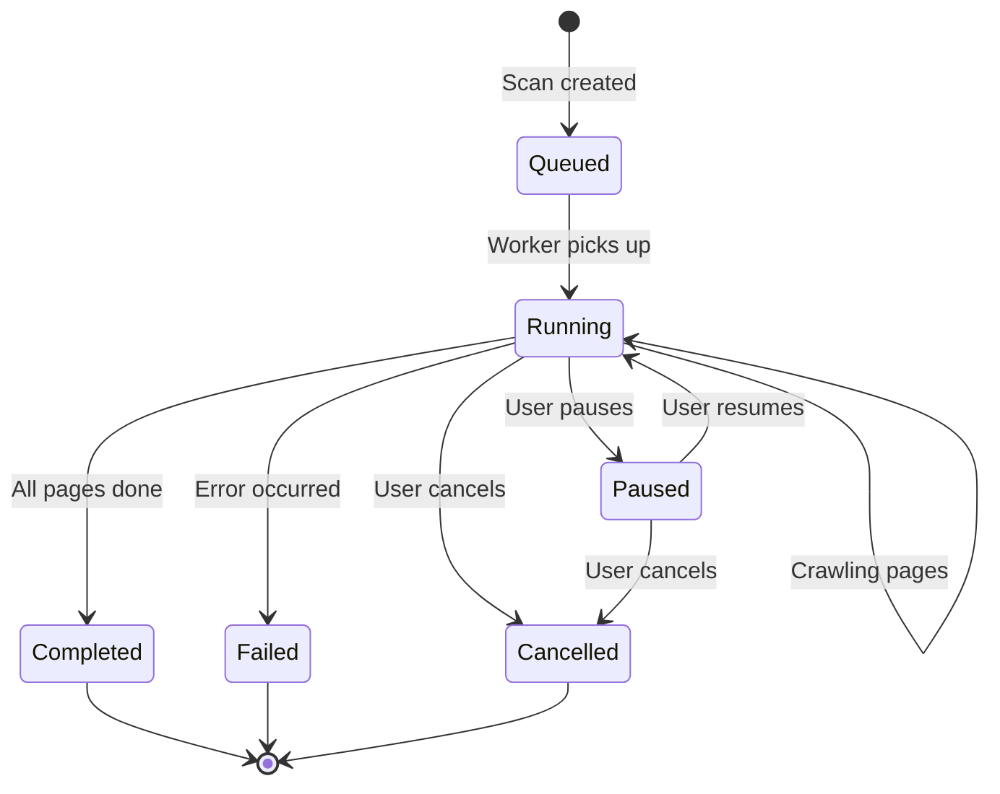
```mermaid
stateDiagram-v2
    [*] --> Queued: Scan created
    
    Queued --> Running: Worker picks up
    Running --> Running: Crawling pages
    Running --> Paused: User pauses
    Paused --> Running: User resumes
    Running --> Completed: All pages done
    Running --> Failed: Error occurred
    Running --> Cancelled: User cancels
    Paused --> Cancelled: User cancels
    
    Completed --> [*]
    Failed --> [*]
    Cancelled --> [*]
```

### Crawler Architecture

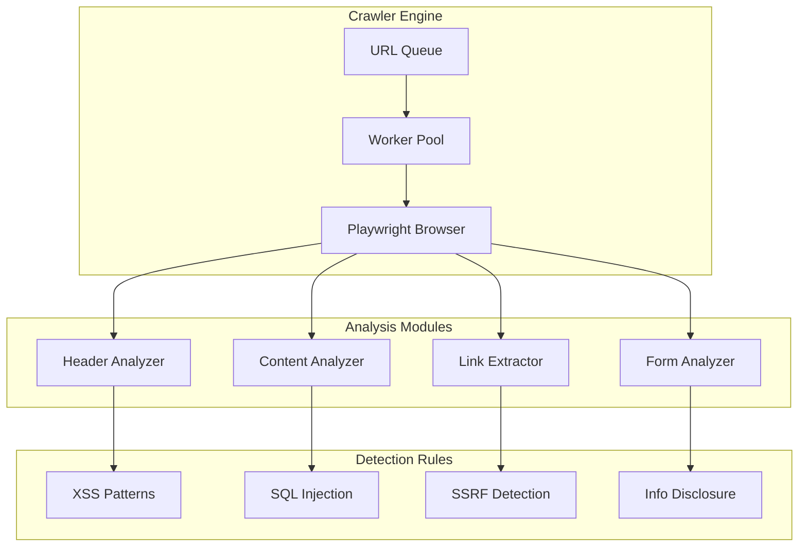
```mermaid
graph TB
    subgraph "Crawler Engine"
        Queue[URL Queue]
        Workers[Worker Pool]
        Browser[Playwright Browser]
    end
    
    subgraph "Analysis Modules"
        Headers[Header Analyzer]
        Content[Content Analyzer]
        Links[Link Extractor]
        Forms[Form Analyzer]
    end
    
    subgraph "Detection Rules"
        XSS[XSS Patterns]
        SQLi[SQL Injection]
        SSRF[SSRF Detection]
        InfoLeak[Info Disclosure]
    end
    
    Queue --> Workers
    Workers --> Browser
    Browser --> Headers
    Browser --> Content
    Browser --> Links
    Browser --> Forms
    
    Headers --> XSS
    Content --> SQLi
    Links --> SSRF
    Forms --> InfoLeak
```

### Scan Execution Flow

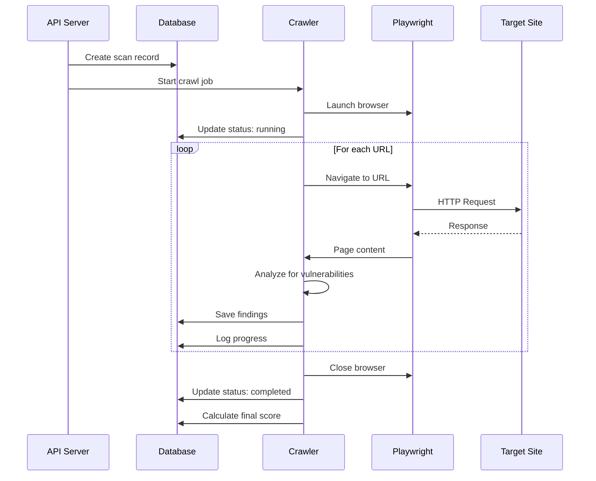
```mermaid
sequenceDiagram
    participant API as API Server
    participant DB as Database
    participant C as Crawler
    participant P as Playwright
    participant T as Target Site
    
    API->>DB: Create scan record
    API->>C: Start crawl job
    C->>P: Launch browser
    C->>DB: Update status: running
    
    loop For each URL
        C->>P: Navigate to URL
        P->>T: HTTP Request
        T-->>P: Response
        P->>C: Page content
        C->>C: Analyze for vulnerabilities
        C->>DB: Save findings
        C->>DB: Log progress
    end
    
    C->>P: Close browser
    C->>DB: Update status: completed
    C->>DB: Calculate final score
```

### Vulnerability Detection

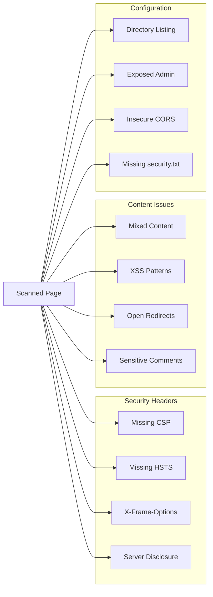
```mermaid
graph LR
    subgraph "Security Headers"
        CSP[Missing CSP]
        HSTS[Missing HSTS]
        XFrame[X-Frame-Options]
        ServerInfo[Server Disclosure]
    end
    
    subgraph "Content Issues"
        Mixed[Mixed Content]
        XSS[XSS Patterns]
        Redirect[Open Redirects]
        Comments[Sensitive Comments]
    end
    
    subgraph "Configuration"
        DirList[Directory Listing]
        AdminPaths[Exposed Admin]
        CORS[Insecure CORS]
        SecurityTxt[Missing security.txt]
    end
    
    Page[Scanned Page] --> CSP
    Page --> HSTS
    Page --> XFrame
    Page --> ServerInfo
    Page --> Mixed
    Page --> XSS
    Page --> Redirect
    Page --> Comments
    Page --> DirList
    Page --> AdminPaths
    Page --> CORS
    Page --> SecurityTxt
```

### Scan Depth Options

| Depth | Pages Analyzed | Best For |
|-------|----------------|----------|
| **Quick** | Up to 25 pages | Fast overview, CI/CD pipelines |
| **Standard** | Up to 100 pages | Regular security checks |
| **Deep** | Up to 500 pages | Comprehensive audits |

---

## 🎨 Frontend Architecture

### Page Structure


```mermaid
graph TD
    subgraph "Route Groups"
        Marketing["(marketing)"]
        Auth["(auth)"]
        Dashboard["(dashboard)"]
    end
    
    subgraph "Marketing Pages"
        Landing[Landing Page]
        Features[Features]
        Services[Services]
        Learn[Learn]
    end
    
    subgraph "Auth Pages"
        Login[Login]
        Signup[Signup]
        MFASetup[MFA Setup]
        Verify2FA[Verify 2FA]
    end
    
    subgraph "Dashboard Pages"
        DashMain[Dashboard]
        Projects[Projects]
        ProjectDetail[Project Detail]
        Scans[Scans]
        ScanDetail[Scan Detail]
        Reports[Reports]
        Academy[Security Academy]
        Settings[Settings]
    end
    
    Marketing --> Landing
    Marketing --> Features
    Marketing --> Services
    Marketing --> Learn
    
    Auth --> Login
    Auth --> Signup
    Auth --> MFASetup
    Auth --> Verify2FA
    
    Dashboard --> DashMain
    Dashboard --> Projects
    Dashboard --> ProjectDetail
    Dashboard --> Scans
    Dashboard --> ScanDetail
    Dashboard --> Reports
    Dashboard --> Academy
    Dashboard --> Settings
```

### Component Hierarchy

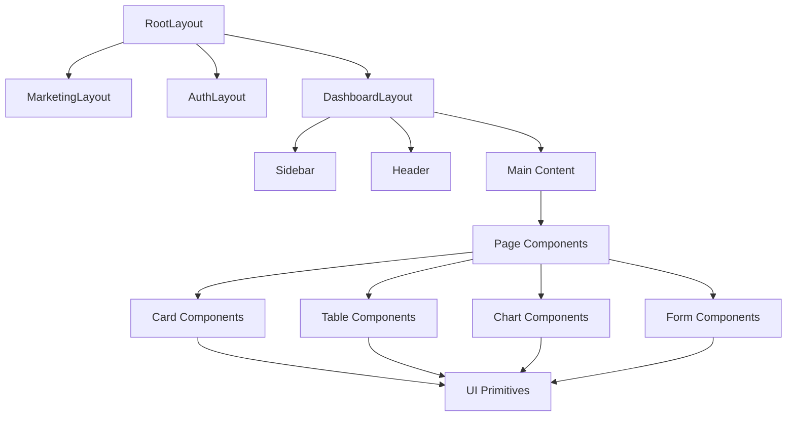
```mermaid
graph TD
    App[RootLayout]
    
    App --> MarketingLayout[MarketingLayout]
    App --> AuthLayout[AuthLayout]
    App --> DashboardLayout[DashboardLayout]
    
    DashboardLayout --> Sidebar[Sidebar]
    DashboardLayout --> Header[Header]
    DashboardLayout --> MainContent[Main Content]
    
    MainContent --> PageComponents[Page Components]
    
    PageComponents --> Cards[Card Components]
    PageComponents --> Tables[Table Components]
    PageComponents --> Charts[Chart Components]
    PageComponents --> Forms[Form Components]
    
    Cards --> UI[UI Primitives]
    Tables --> UI
    Charts --> UI
    Forms --> UI
```

### State Management

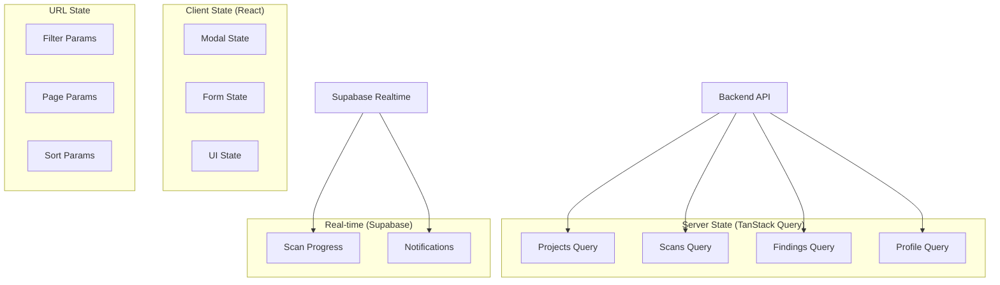
```mermaid
graph TB
    subgraph "Server State (TanStack Query)"
        Projects[Projects Query]
        Scans[Scans Query]
        Findings[Findings Query]
        Profile[Profile Query]
    end
    
    subgraph "Client State (React)"
        Modals[Modal State]
        Forms[Form State]
        UI[UI State]
    end
    
    subgraph "URL State"
        Filters[Filter Params]
        Pagination[Page Params]
        Sort[Sort Params]
    end
    
    subgraph "Real-time (Supabase)"
        ScanProgress[Scan Progress]
        Notifications[Notifications]
    end
    
    API[Backend API] --> Projects
    API --> Scans
    API --> Findings
    API --> Profile
    
    Supabase[Supabase Realtime] --> ScanProgress
    Supabase --> Notifications
```

---

## 📡 API Reference

### API Architecture

```mermaid
graph TB
    subgraph "API Gateway"
        Entry[Request Entry]
        RateLimit[Rate Limiter]
        Auth[Auth Middleware]
    end
    
    subgraph "Route Handlers"
        Scans[/scans]
        Projects[/projects]
        Profiles[/profiles]
        MFA[/mfa]
        Health[/health]
    end
    
    subgraph "Validation"
        Zod[Zod Schemas]
    end
    
    subgraph "Response"
        Success[Success Handler]
        Error[Error Handler]
    end
    
    Entry --> RateLimit
    RateLimit --> Auth
    Auth --> Scans
    Auth --> Projects
    Auth --> Profiles
    Auth --> MFA
    Entry --> Health
    
    Scans --> Zod
    Projects --> Zod
    Profiles --> Zod
    MFA --> Zod
    
    Zod --> Success
    Zod --> Error
```

### Endpoints

| Method | Endpoint | Description | Auth | Validation |
|--------|----------|-------------|------|------------|
| `GET` | `/` | API info | Public | N/A |
| `GET` | `/health` | Health check with DB status | Public | N/A |
| `GET` | `/docs` | Swagger UI | Public | N/A |
| `POST` | `/scans` | Create new scan | 🔐 JWT | ✅ Zod |
| `GET` | `/scans/:id` | Get scan details | 🔐 JWT | ✅ UUID |
| `POST` | `/scans/:id/pause` | Pause active scan | 🔐 JWT | ✅ UUID |
| `POST` | `/scans/:id/resume` | Resume paused scan | 🔐 JWT | ✅ UUID |
| `POST` | `/scans/:id/cancel` | Cancel scan | 🔐 JWT | ✅ UUID |
| `POST` | `/projects` | Create project | 🔐 JWT | ✅ Zod |
| `GET` | `/projects` | List user projects | 🔐 JWT | ✅ Pagination |
| `GET` | `/projects/:id` | Get project details | 🔐 JWT | ✅ UUID |
| `GET` | `/profiles` | Get user profile | 🔐 JWT | N/A |
| `POST` | `/profiles` | Update profile | 🔐 JWT | ✅ Zod |
| `GET` | `/mfa/status` | MFA enrollment status | 🔐 JWT | N/A |
| `POST` | `/mfa/enroll` | Start MFA setup | 🔐 JWT | N/A |
| `POST` | `/mfa/verify` | Verify MFA code | 🔐 JWT | ✅ Zod |

### Request Validation Flow

```mermaid
sequenceDiagram
    participant C as Client
    participant R as Router
    participant V as Validator
    participant H as Handler
    participant D as Database
    
    C->>R: HTTP Request
    R->>V: Validate schema
    
    alt Invalid
        V-->>C: 400 Bad Request
    else Valid
        V->>H: Validated data
        H->>D: Database operation
        D-->>H: Result
        H-->>C: 200 Success
    end
```

### Response Format

**Success Response:**
```json
{
  "success": true,
  "data": { },
  "meta": {
    "page": 1,
    "limit": 20,
    "total": 100
  }
}
```

**Error Response:**
```json
{
  "success": false,
  "error": {
    "code": "VALIDATION_ERROR",
    "message": "Invalid input data",
    "details": []
  }
}
```

### Health Check Response

```json
{
  "status": "healthy",
  "timestamp": "2026-02-07T10:00:00.000Z",
  "uptime": 12345.67,
  "version": "1.0.0",
  "checks": {
    "database": { "status": "healthy", "latency_ms": 42 }
  },
  "memory": {
    "heapUsed": "45 MB",
    "heapTotal": "72 MB"
  }
}
```

---

## ⚡ Real-Time Features

### Real-Time Architecture

```mermaid
graph TB
    subgraph "Client"
        Component[React Component]
        Subscription[Supabase Subscription]
    end
    
    subgraph "Supabase"
        Realtime[Realtime Server]
        Postgres[PostgreSQL]
    end
    
    subgraph "Backend"
        Crawler[Crawler]
        API[API Server]
    end
    
    Crawler -->|INSERT/UPDATE| Postgres
    API -->|INSERT/UPDATE| Postgres
    Postgres -->|Trigger| Realtime
    Realtime -->|WebSocket| Subscription
    Subscription -->|State Update| Component
```

### Live Console Implementation

```mermaid
sequenceDiagram
    participant UI as Live Console
    participant Sub as Subscription
    participant RT as Supabase Realtime
    participant DB as Database
    participant C as Crawler
    
    UI->>Sub: Subscribe to scan:{id}
    Sub->>RT: Open WebSocket
    
    loop During Scan
        C->>DB: INSERT scan_log
        DB->>RT: Trigger notification
        RT->>Sub: Push log entry
        Sub->>UI: Append to console
        UI->>UI: Auto-scroll
    end
    
    UI->>Sub: Unsubscribe
    Sub->>RT: Close WebSocket
```

### Real-Time Channels

| Channel | Event Type | Data | Consumer |
|---------|------------|------|----------|
| `scan:{id}` | INSERT | scan_logs row | Live Console |
| `scan:{id}` | UPDATE | scan progress | Progress Ring |
| `findings:{scan_id}` | INSERT | finding row | Findings Grid |
| `projects:{user_id}` | UPDATE | project metrics | Dashboard |

---

## 🚢 Deployment

### Production Deployment Architecture

```mermaid
graph TB
    subgraph "DNS"
        Domain[vulnscanner.tech]
    end
    
    subgraph "Vercel"
        Edge[Edge Network]
        Frontend[Next.js App]
    end
    
    subgraph "Railway"
        Backend[Fastify API]
        Playwright[Playwright Browsers]
    end
    
    subgraph "Supabase Cloud"
        Auth[Authentication]
        DB[(PostgreSQL)]
        Storage[Object Storage]
        Realtime[Realtime]
    end
    
    subgraph "Monitoring"
        Sentry[Sentry]
    end
    
    Domain --> Edge
    Edge --> Frontend
    Frontend --> Backend
    Frontend --> Auth
    Frontend --> Realtime
    Backend --> DB
    Backend --> Playwright
    Backend --> Sentry
    Frontend --> Sentry
```

### Docker Architecture

```mermaid
graph TB
    subgraph "Docker Compose"
        FrontendContainer[frontend:3000]
        BackendContainer[backend:3001]
    end
    
    subgraph "External Services"
        Supabase[Supabase Cloud]
        Sentry[Sentry Cloud]
    end
    
    FrontendContainer --> BackendContainer
    BackendContainer --> Supabase
    BackendContainer --> Sentry
    FrontendContainer --> Supabase
```

### Deployment Platforms

| Component | Platform | Configuration | Features |
|-----------|----------|---------------|----------|
| **Frontend** | Vercel | Automatic from GitHub | Edge network, serverless |
| **Backend** | Railway | Dockerfile.railway | Docker support, cron jobs |
| **Database** | Supabase | Cloud-hosted | Managed PostgreSQL |
| **Monitoring** | Sentry | Cloud-hosted | Error tracking |

---

## 📖 User Guide

### Getting Started

#### Creating an Account

1. Navigate to the VulnScanner website
2. Click **"Get Started"** or **"Sign Up"**
3. Choose your sign-up method:
   - **Email/Password**: Enter your email and create a strong password
   - **Google OAuth**: Click "Sign in with Google" for quick registration
4. Verify your email address by clicking the link sent to your inbox
5. Complete your profile setup

#### Setting Up 2FA (Recommended)

1. Go to **Settings → Security**
2. Click **"Enable Two-Factor Authentication"**
3. Scan the QR code with Google Authenticator or similar app
4. Enter the 6-digit verification code
5. **Save your backup codes** in a secure location

> ⚠️ **Important**: Store backup codes safely! They are the only way to recover your account if you lose access to your authenticator app.

### Dashboard Overview

| Section | Description |
|---------|-------------|
| **Quick Stats** | Total projects, active scans, critical vulnerabilities, and security score |
| **Recent Scans** | List of your 5 most recent scans with status |
| **Vulnerability Trend** | Graph showing vulnerability discoveries over time |
| **Top Vulnerabilities** | Most common vulnerability types across all projects |
| **Quick Actions** | Buttons for "New Scan" and "New Project" |

### Understanding Security Score

| Score Range | Rating | Meaning |
|-------------|--------|---------|
| 90-100 | Excellent | Few or no vulnerabilities found |
| 70-89 | Good | Minor issues to address |
| 50-69 | Fair | Moderate vulnerabilities present |
| 30-49 | Poor | Significant security issues |
| 0-29 | Critical | Immediate attention required |

### Projects

#### Creating a New Project

1. Click **"New Project"** button
2. Enter project details:
   - **Project Name**: A descriptive name (e.g., "Company Website")
   - **Description**: Optional details about the project
   - **Base URL**: The primary URL for this project
3. Click **"Create Project"**

### Scanning

#### Starting a New Scan

1. Navigate to a project or click **"New Scan"**
2. Configure scan settings:
   - **Target URL**: The starting point for the scan
   - **Scan Depth**: Quick / Standard / Deep
   - **Include Subdomains**: Yes / No
3. Click **"Start Scan"**

#### Scan Controls

| Button | Action |
|--------|--------|
| **Pause** | Temporarily stops the scan (can resume later) |
| **Resume** | Continues a paused scan |
| **Cancel** | Stops the scan permanently |

#### Scan Status Reference

| Status | Meaning |
|--------|---------|
| `queued` | Scan is waiting to start |
| `running` | Scan is actively analyzing pages |
| `paused` | Scan is temporarily stopped |
| `completed` | Scan finished successfully |
| `failed` | Scan encountered an error |
| `cancelled` | Scan was stopped by user |

### Understanding Severity Levels

| Severity | Color | Description | Action Required |
|----------|-------|-------------|-----------------|
| **Critical** | 🔴 Red | Severe vulnerabilities requiring immediate fix | Fix within 24 hours |
| **High** | 🟠 Orange | Significant security risks | Fix within 1 week |
| **Medium** | 🟡 Yellow | Moderate issues | Fix within 1 month |
| **Low** | 🔵 Blue | Minor issues or best practice suggestions | Fix when possible |
| **Info** | ⚪ Gray | Informational findings | Review and note |

### Reports

#### Report Types

| Report | Contents |
|--------|----------|
| **Executive Summary** | High-level overview for management |
| **Technical Report** | Detailed findings for developers |
| **Compliance Report** | Mapped to security standards |

#### Export Formats

- **PDF**: For sharing and printing
- **CSV**: For spreadsheet analysis
- **JSON**: For integration with other tools

### Security Academy

| Section | Description |
|---------|-------------|
| **CTF Practice** | Capture The Flag challenges to practice skills |
| **Resources** | Security tools, cheat sheets, and references |
| **News** | Latest cybersecurity news and updates |
| **Community** | Forums and community discussions |

---

## ⚙️ Configuration

### Environment Variables

```mermaid
graph TB
    subgraph "Backend Environment"
        SUPABASE_URL[SUPABASE_URL]
        SERVICE_KEY[SUPABASE_SERVICE_ROLE_KEY]
        PORT[PORT]
        NODE_ENV[NODE_ENV]
        LOG_LEVEL[LOG_LEVEL]
        ORIGINS[ALLOWED_ORIGINS]
        SENTRY_DSN[SENTRY_DSN]
    end
    
    subgraph "Frontend Environment"
        PUB_URL[NEXT_PUBLIC_SUPABASE_URL]
        ANON_KEY[NEXT_PUBLIC_SUPABASE_ANON_KEY]
        BACKEND[BACKEND_URL]
        FE_SENTRY[NEXT_PUBLIC_SENTRY_DSN]
    end
```

### Backend Environment Variables

| Variable | Required | Default | Description |
|----------|----------|---------|-------------|
| `SUPABASE_URL` | ✅ | - | Supabase project URL |
| `SUPABASE_SERVICE_ROLE_KEY` | ✅ | - | Service role key for backend |
| `PORT` | ❌ | 3001 | Server port |
| `NODE_ENV` | ❌ | development | Environment mode |
| `LOG_LEVEL` | ❌ | info | Pino log level |
| `ALLOWED_ORIGINS` | ❌ | localhost:3000 | CORS origins |
| `RATE_LIMIT_MAX` | ❌ | 100 | Requests per window |
| `SENTRY_DSN` | ❌ | - | Sentry error tracking |

### Frontend Environment Variables

| Variable | Required | Description |
|----------|----------|-------------|
| `NEXT_PUBLIC_SUPABASE_URL` | ✅ | Supabase project URL |
| `NEXT_PUBLIC_SUPABASE_ANON_KEY` | ✅ | Public anon key |
| `BACKEND_URL` | ✅ | Backend API URL |
| `NEXT_PUBLIC_SENTRY_DSN` | ❌ | Sentry error tracking |

---

## 🧪 Testing

### Testing Pyramid

```mermaid
graph TB
    subgraph "Testing Strategy"
        E2E[E2E Tests - Playwright]
        Integration[Integration Tests]
        Unit[Unit Tests - Jest/Vitest]
    end
    
    E2E --> Integration
    Integration --> Unit
    
    style E2E fill:#ff6b6b
    style Integration fill:#feca57
    style Unit fill:#48dbfb
```

### Test Coverage

| Suite | Framework | Tests | Status |
|-------|-----------|-------|--------|
| Backend Unit | Jest | 22 | ✅ Passing |
| Frontend Unit | Vitest | 22 | ✅ Passing |
| E2E Tests | Playwright | Multiple | ✅ Passing |

### Running Tests

```bash
# Backend unit tests
cd backend && npm test

# Frontend unit tests
cd frontend && npm test

# E2E tests
npm run test:e2e
```

### CI/CD Pipeline

```mermaid
graph LR
    Push[Git Push] --> Lint[Lint Check]
    Lint --> TypeCheck[Type Check]
    TypeCheck --> UnitTests[Unit Tests]
    UnitTests --> Build[Build]
    Build --> E2E[E2E Tests]
    E2E --> Deploy{Deploy?}
    Deploy -->|main| Production[Production]
    Deploy -->|PR| Preview[Preview]
```

---

## 🔧 Troubleshooting

### Common Issues

#### "Scan Stuck at 0%"

**Cause**: Target URL may be unreachable or blocking the scanner.

**Solution**:
1. Verify the URL is accessible in your browser
2. Check if the site has aggressive bot protection
3. Try scanning a different URL on the same domain

#### "No Vulnerabilities Found"

**Cause**: Site may have excellent security, or scan depth was too shallow.

**Solution**:
1. Try a deeper scan (Standard or Deep)
2. Ensure correct target URL
3. Check scan logs for any errors

#### "Scan Failed"

**Cause**: Connection issues or server errors.

**Solution**:
1. Wait a few minutes and retry
2. Check your internet connection
3. View scan logs for specific error messages
4. Contact support if issue persists

#### "Cannot Login After 2FA Setup"

**Cause**: Authenticator app time may be out of sync.

**Solution**:
1. Ensure your phone's time is set to automatic
2. Use a backup code if available
3. Request Email OTP as alternative
4. Contact support for account recovery

### Known Limitations

| Limitation | Details |
|------------|---------|
| **Max Pages per Scan** | 500 pages (Deep scan) |
| **Scan Timeout** | 30 minutes per scan |
| **Concurrent Scans** | 2 scans simultaneously |
| **Rate Limiting** | Respectful crawling to avoid blocking |
| **Authentication** | Logged-in areas cannot be scanned (planned feature) |

### Browser Compatibility

| Browser | Support Level |
|---------|---------------|
| Chrome (latest) | ✅ Fully Supported |
| Firefox (latest) | ✅ Fully Supported |
| Safari (latest) | ✅ Fully Supported |
| Edge (latest) | ✅ Fully Supported |
| Internet Explorer | ❌ Not Supported |

---

## ❓ FAQ

### General Questions

**Q: Is VulnScanner free?**
A: VulnScanner offers a free tier with limited scans. Premium plans provide additional features.

**Q: How long does a scan take?**
A: Quick scans: 1-3 minutes. Standard: 5-10 minutes. Deep: 15-30 minutes. Time varies based on site size.

**Q: Can I scan any website?**
A: You should only scan websites you own or have permission to test. Unauthorized scanning may be illegal.

**Q: Does scanning affect my website?**
A: VulnScanner uses passive scanning techniques. It reads pages like a regular visitor and doesn't attempt exploitation.

### Security Questions

**Q: Is my data secure?**
A: Yes. All data is encrypted in transit (HTTPS) and at rest. We follow security best practices.

**Q: Who can see my scan results?**
A: Only you can see your results. Data isolation is enforced at the database level.

**Q: Can I delete my data?**
A: Yes. You can delete individual scans, projects, or your entire account in Settings.

### Scan Questions

**Q: Why are some vulnerabilities not detected?**
A: VulnScanner focuses on common web vulnerabilities. Some issues require deeper analysis or login access.

**Q: Can I scan password-protected pages?**
A: Not currently. Authenticated scanning is a planned feature.

**Q: How often should I scan?**
A: We recommend weekly scans for active projects, or after each major deployment.

---

## 🗺️ Roadmap

### Planned Features

```mermaid
timeline
    title VulnScanner Roadmap
    
    section Q1 2026
        Authenticated Scanning : Login support
        API Access : CI/CD integration
        
    section Q2 2026
        Team Features : Multi-user workspaces
        Slack Integration : Alert notifications
        
    section Q3 2026
        Custom Rules : User-defined patterns
        Compliance Reports : SOC2, HIPAA mapping
        
    section Q4 2026
        Mobile App : React Native
        AI Insights : ML-powered analysis
```

### Technical Debt

| Item | Priority | Effort |
|------|----------|--------|
| Add response compression | Medium | Low |
| Implement Redis caching | High | Medium |
| Increase test coverage to 80% | High | High |
| Complete Assets page | Medium | Medium |

---

## 🤝 Contributing

We welcome contributions! Please see our contributing guidelines for details.

1. Fork the repository
2. Create a feature branch (`git checkout -b feature/amazing-feature`)
3. Commit your changes (`git commit -m 'Add amazing feature'`)
4. Push to the branch (`git push origin feature/amazing-feature`)
5. Open a Pull Request

---

## 📄 License

This project is licensed under the MIT License - see the [LICENSE](LICENSE) file for details.

---

## 📞 Support

- **Email**: support@vulnscanner.tech
- **Documentation**: [docs.vulnscanner.tech](https://docs.vulnscanner.tech)
- **Issues**: [GitHub Issues](https://github.com/krishna0605/vulnscanner/issues)

---

## 🙏 Acknowledgments

- [Next.js](https://nextjs.org/) - The React Framework
- [Fastify](https://www.fastify.io/) - Fast and low overhead web framework
- [Supabase](https://supabase.com/) - Open source Firebase alternative
- [Playwright](https://playwright.dev/) - Browser automation
- [Radix UI](https://www.radix-ui.com/) - Accessible components

---

<div align="center">

**Made with ❤️ by the VulnScanner Team**

**Document Version:** 2.0.0 | **Last Updated:** February 7, 2026

</div>
