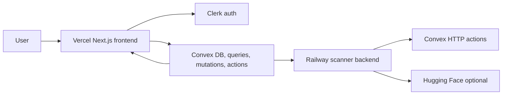
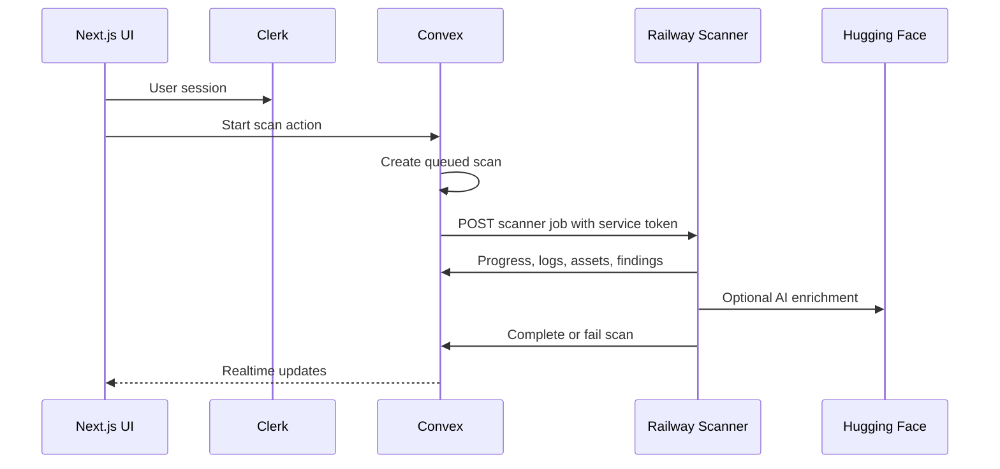

# VulnScanner

VulnScanner is a web security scanning dashboard for managing projects, running Playwright-based scans, tracking findings, and reviewing reports in realtime.

## Current Stack

| Layer | Service |
| --- | --- |
| Frontend | Next.js on Vercel |
| Authentication | Clerk |
| App database and realtime backend | Convex |
| Scanner runtime | Fastify + Playwright on Railway |
| Optional AI enrichment | Hugging Face |

## Architecture



## Scan Flow



## Repository Layout

```text
.
├── frontend/        Next.js app, Convex functions, Clerk UI
├── backend/         Fastify scanner service and Playwright crawler
├── docs/            Deployment and environment docs
├── tests/           Playwright E2E tests
└── docker-compose.yml
```

## Local Setup

Install dependencies:

```bash
npm install
cd frontend && npm install
cd ../backend && npm install
```

Create environment files:

```bash
cp frontend/.env.example frontend/.env.local
cp backend/.env.example backend/.env
```

Start Convex in the frontend workspace:

```bash
cd frontend
npx convex dev
```

Start the frontend:

```bash
cd frontend
npm run dev
```

Start the scanner backend:

```bash
cd backend
npm run dev
```

## Required Environment Variables

Frontend / Vercel:

```env
NEXT_PUBLIC_CONVEX_URL=https://your-convex-deployment.convex.cloud
NEXT_PUBLIC_CONVEX_SITE_URL=https://your-convex-deployment.convex.site
NEXT_PUBLIC_CLERK_PUBLISHABLE_KEY=pk_test_or_live_...
CLERK_SECRET_KEY=sk_test_or_live_...
CLERK_WEBHOOK_SECRET=whsec_...
NEXT_PUBLIC_CLERK_SIGN_IN_URL=/sign-in
NEXT_PUBLIC_CLERK_SIGN_UP_URL=/sign-up
NEXT_PUBLIC_CLERK_AFTER_SIGN_IN_URL=/dashboard
NEXT_PUBLIC_CLERK_AFTER_SIGN_UP_URL=/dashboard
BACKEND_URL=http://localhost:3001
```

Convex:

```env
CLERK_JWT_ISSUER_DOMAIN=https://your-clerk-domain.clerk.accounts.dev
CLERK_WEBHOOK_SECRET=whsec_...
RAILWAY_BACKEND_URL=http://localhost:3001
SCANNER_SERVICE_TOKEN=replace-with-a-long-random-shared-secret
```

Railway backend:

```env
CONVEX_SITE_URL=https://your-convex-deployment.convex.site
SCANNER_SERVICE_TOKEN=replace-with-the-same-secret-used-in-convex
NODE_ENV=production
PORT=3001
ALLOWED_ORIGINS=https://your-vercel-domain.vercel.app
RATE_LIMIT_MAX=100
RATE_LIMIT_WINDOW_MS=60000
HUGGINGFACE_API_TOKEN=optional
```

## Testing

Frontend:

```bash
cd frontend
npm run build
npm test
```

Backend:

```bash
cd backend
npm run build
npm test
```

E2E:

```bash
npx playwright test
```

## Deployment

1. Deploy Convex from `frontend` with `npx convex deploy`.
2. Deploy the Railway scanner backend from `backend`.
3. Put the Railway public URL in Convex as `RAILWAY_BACKEND_URL`.
4. Deploy the Vercel frontend from `frontend`.
5. Verify Clerk login, project creation, scan start, realtime progress, findings, and reports.

More details live in [DEPLOYMENT.md](DEPLOYMENT.md) and [docs/ENVIRONMENT_VARIABLES.md](docs/ENVIRONMENT_VARIABLES.md).

## Security Notes

- Do not commit real secrets.
- Keep `SCANNER_SERVICE_TOKEN` identical in Convex and Railway.
- Rotate keys that were exposed in chat, screenshots, logs, or old deployments.
- Keep Playwright crawling on Railway; Convex should store compact scan state and results, not raw HTML or screenshots.
