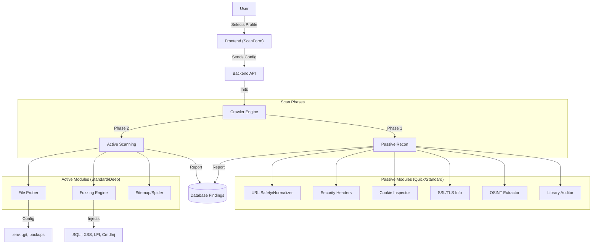

# Implementation Plan - Enhanced Feature-Rich Scanner

## Architecture Diagram

## Phase 1: Frontend Implementation
**Goal:** Update the UI to support and request the new advanced features.

#### [MODIFY] [scan-form.tsx](file:///c:/Users/Admin/Desktop/vulscanner/frontend/src/components/scans/scan-form.tsx)
1.  **Update `formData` State:**
    -   Add boolean flags: `checkCookies`, `checkSSL`, `checkOSINT`, `checkSCA`, `checkProbing`.
2.  **Update `DEFAULT_SCAN_TYPES`:**
    -   **Quick Scan:**
        -   Enable: `checkHeaders`, `checkCookies`, `checkSSL`, `checkOSINT`.
        -   Description: "Passive recon: Headers, SSL, Cookies, and Email/Social extraction."
    -   **Standard Scan:**
        -   Enable: All Quick + `checkSCA` (Libraries), `checkProbing` (Sensitive Files), `vectorMisconfig`.
        -   Description: "Health check: Outdated libs, exposed files (.env), and basic vectors."
    -   **Deep Scan:**
        -   Enable: All Standard + `vectorSQLi`, `vectorXSS`, `vectorLFI`, `vectorCmdInj`.
        -   Description: "Full Audit: Heavy fuzzing (SQLi/XSS/LFI) and Sitemap parsing."
3.  **UI Adjustments:**
    -   Ensure the "Selected Profile Configuration" text displays a summary of enabled advanced features (e.g., "OSINT: On, Fuzzing: On").

## Phase 2: Backend Implementation
**Goal:** Build the logic to execute the new checks.

#### [MODIFY] [crawler.ts](file:///c:/Users/Admin/Desktop/vulscanner/backend/src/lib/crawler.ts)
1.  **Update [ScanConfig](file:///c:/Users/Admin/Desktop/vulscanner/backend/src/lib/crawler.ts#9-34) Interface:**
    -   Add the new boolean flags to match Frontend.
2.  **Implement `CookieInspector`:**
    -   Check `Set-Cookie` headers for `HttpOnly`, `Secure`, `SameSite`.
3.  **Implement `OSINTExtractor`:**
    -   Scan `page.content()` for Emails (`match(/[a-zA-Z0-9._%+-]+@[a-zA-Z0-9.-]+\.[a-zA-Z]{2,}/)`) and Social Links.
4.  **Implement `FileProber`:**
    -   If `depth == 0` and `checkProbing` is true, attempt to fetch [/.env](file:///c:/Users/Admin/Desktop/vulscanner/backend/.env), [/.git/HEAD](file:///c:/Users/Admin/Desktop/vulscanner/.git/HEAD), `/wp-config.php.bak`.
    -   Report finding if status is 200.
5.  **Implement `LibraryAuditor` (SCA):**
    -   Use [Fingerprinter](file:///c:/Users/Admin/Desktop/vulscanner/backend/src/lib/fingerprinter.ts#31-233) results.
    -   Map common versions (e.g., jQuery < 3.0.0) to "Outdated Library" findings.
6.  **Enhance `FuzzingEngine`:**
    -   Add LFI payloads (`../../../../etc/passwd`).
    -   Add Command Injection payloads (`| whoami`).

## Order of Operations
1.  **Frontend:** Update the definitions and state. (User can review UI changes immediately).
2.  **Backend:** Implement the logic behind the flags.
