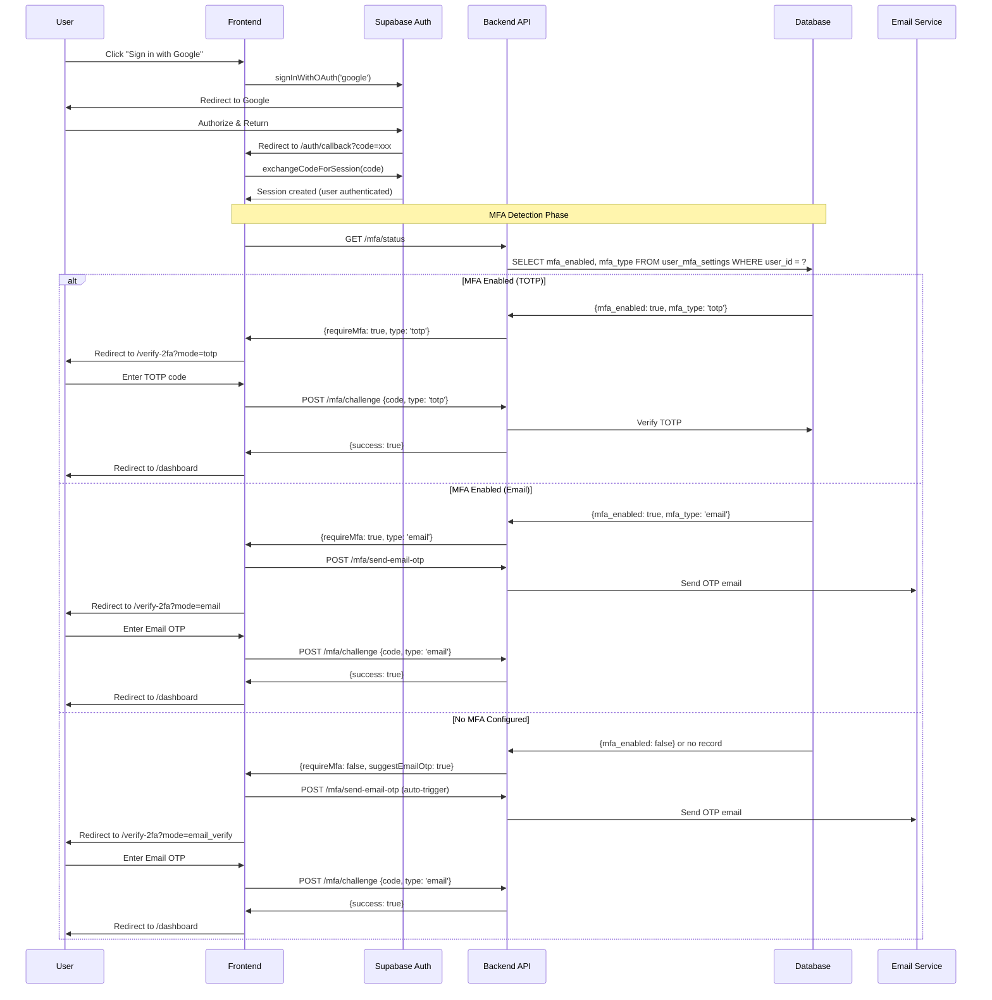
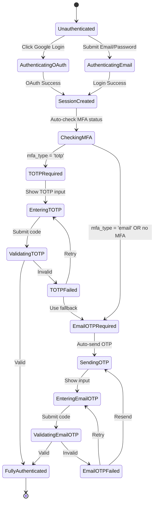

# Enhanced Login Flow with Automatic MFA Detection

## Goal

Create a seamless, secure login experience that:
1. **Automatically detects** if a user has MFA enabled after OAuth/email login
2. **Routes to TOTP verification** if the user has enabled authenticator-based 2FA
3. **Offers Email OTP** as the primary option if the user has NO MFA configured

---

## Flow Diagram

```mermaid
flowchart TB
    Start([User clicks Login]) --> LoginMethod{Login Method?}
    
    LoginMethod -->|Google OAuth| GoogleAuth[Google OAuth Flow]
    LoginMethod -->|Email/Password| EmailAuth[Email Password Login]
    
    GoogleAuth --> Callback[/auth/callback]
    EmailAuth --> Callback
    
    Callback --> CheckMFA{Check user_mfa_settings<br/>mfa_enabled?}
    
    CheckMFA -->|mfa_enabled = TRUE| MFAType{MFA Type?}
    CheckMFA -->|mfa_enabled = FALSE| NoMFA[No MFA Configured]
    
    MFAType -->|TOTP| TOTPVerify[/verify-2fa<br/>Show TOTP Input]
    MFAType -->|Email| EmailOTPVerify[/verify-2fa<br/>Auto-send Email OTP]
    
    NoMFA --> SendEmailOTP[Auto-send Email OTP<br/>for verification]
    SendEmailOTP --> EmailOTPVerify
    
    TOTPVerify --> EnterCode[User enters 6-digit code]
    EmailOTPVerify --> EnterEmailCode[User enters Email OTP]
    
    EnterCode --> ValidateTOTP{Valid TOTP?}
    EnterEmailCode --> ValidateEmail{Valid Email OTP?}
    
    ValidateTOTP -->|Yes| Dashboard[✅ Dashboard]
    ValidateTOTP -->|No| TOTPRetry[Show Error<br/>Offer alternatives]
    TOTPRetry -->|Retry| EnterCode
    TOTPRetry -->|Use Backup Code| BackupVerify
    TOTPRetry -->|Send Email OTP| SendFallback[Send Email OTP]
    
    ValidateEmail -->|Yes| Dashboard
    ValidateEmail -->|No| EmailRetry[Show Error<br/>Allow Resend]
    EmailRetry --> EnterEmailCode
    
    BackupVerify --> Dashboard
    SendFallback --> EnterEmailCode
```

---

## Sequence Diagram



---

## State Machine



---

## Proposed Changes

### Backend Changes

#### [MODIFY] [callback/route.ts](file:///c:/Users/Admin/Desktop/vulscanner/frontend/src/app/auth/callback/route.ts)

Update the OAuth callback to check MFA status and redirect appropriately:

```typescript
export async function GET(request: Request) {
  const { searchParams, origin } = new URL(request.url);
  const code = searchParams.get('code');

  if (code) {
    const supabase = createClient();
    const { data: { user }, error } = await supabase.auth.exchangeCodeForSession(code);
    
    if (!error && user) {
      // Check MFA status from backend
      const mfaResponse = await fetch(`${BACKEND_URL}/mfa/status`, {
        headers: { 'Authorization': `Bearer ${session.access_token}` }
      });
      const mfaData = await mfaResponse.json();
      
      if (mfaData.data?.mfaEnabled) {
        // User has MFA - redirect to verification
        return NextResponse.redirect(`${origin}/verify-2fa?mode=${mfaData.data.mfaType}`);
      } else {
        // No MFA - send email OTP and redirect
        await fetch(`${BACKEND_URL}/mfa/send-email-otp`, {
          method: 'POST',
          headers: { 'Authorization': `Bearer ${session.access_token}` }
        });
        return NextResponse.redirect(`${origin}/verify-2fa?mode=email_verify`);
      }
    }
  }

  return NextResponse.redirect(`${origin}/login?error=auth_callback_error`);
}
```

---

#### [MODIFY] [verify-2fa/page.tsx](file:///c:/Users/Admin/Desktop/vulscanner/frontend/src/app/(auth)/verify-2fa/page.tsx)

Update to handle different modes and auto-detect:

- `mode=totp` - Show TOTP input
- `mode=email` - Show Email OTP input (for users with email MFA enabled)
- `mode=email_verify` - Show Email OTP (for users without MFA, as login verification)

---

#### [MODIFY] [mfa.ts](file:///c:/Users/Admin/Desktop/vulscanner/backend/src/routes/mfa.ts)

Update `/mfa/status` to return more detailed info:

```typescript
// GET /mfa/status - Check user's MFA configuration
fastify.get('/mfa/status', async (request, reply) => {
  const userId = request.user!.id;
  
  const { data } = await supabase
    .from('user_mfa_settings')
    .select('mfa_enabled, mfa_type, totp_verified_at')
    .eq('user_id', userId)
    .single();

  return success({
    mfaEnabled: data?.mfa_enabled ?? false,
    mfaType: data?.mfa_type ?? null,
    setupAt: data?.totp_verified_at ?? null,
    // If no MFA, suggest email OTP
    suggestEmailOtp: !data?.mfa_enabled
  });
});
```

---

## Decision Matrix

| User State | After OAuth Login | Action |
|-----------|-------------------|--------|
| MFA enabled (TOTP) | Redirect to `/verify-2fa?mode=totp` | Enter authenticator code |
| MFA enabled (Email) | Auto-send OTP, redirect to `/verify-2fa?mode=email` | Enter email code |
| No MFA configured | Auto-send OTP, redirect to `/verify-2fa?mode=email_verify` | Enter email code |

---

## User Review Required

> [!IMPORTANT]
> **Email OTP as mandatory fallback**: Should users WITHOUT MFA still be required to verify via Email OTP on every login, or should this be optional?

> [!WARNING]  
> **Session persistence**: After Email OTP verification for non-MFA users, should we create a "remembered device" to skip OTP on future logins from the same browser?

---

## Implementation Order

1. **Update `/mfa/status`** - Return `suggestEmailOtp` flag
2. **Update [callback/route.ts](file:///c:/Users/Admin/Desktop/vulscanner/frontend/src/app/auth/callback/route.ts)** - Check MFA status and redirect correctly
3. **Update [verify-2fa/page.tsx](file:///c:/Users/Admin/Desktop/vulscanner/frontend/src/app/%28auth%29/verify-2fa/page.tsx)** - Handle `mode` query parameter
4. **Test all flows** - OAuth with TOTP, OAuth without MFA, Email/Password with MFA

---

## Verification Plan

### Test Cases

| Test Case | Expected Result |
|-----------|-----------------|
| User with TOTP enabled logs in via Google | Redirected to TOTP verification page |
| User without MFA logs in via Google | Email OTP auto-sent, redirected to email verification |
| Valid TOTP code entered | User reaches dashboard |
| Invalid TOTP code entered | Error shown, option for backup/email fallback |
| Valid Email OTP entered | User reaches dashboard |
| Expired Email OTP entered | Error shown, resend option available |
