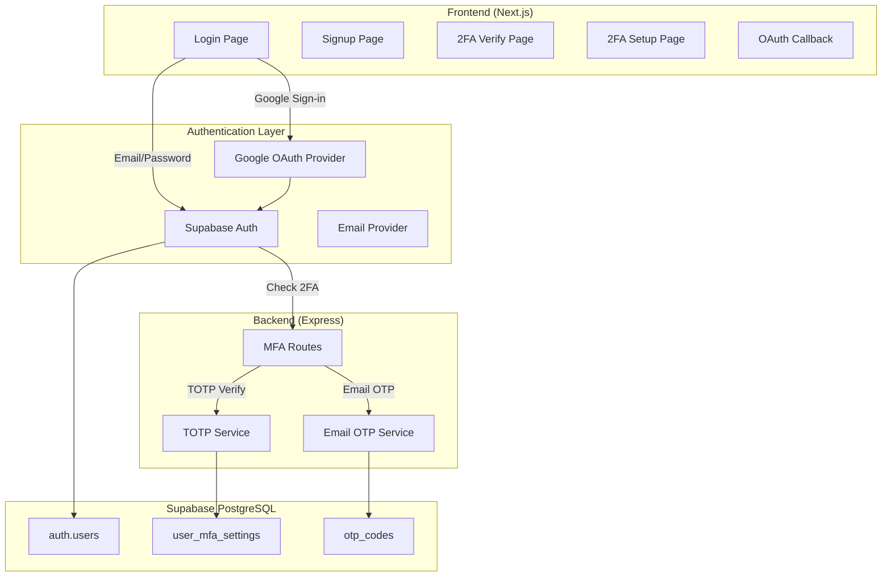
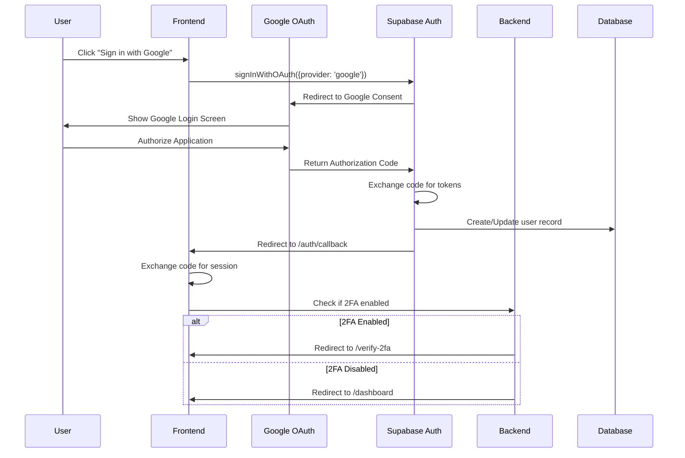
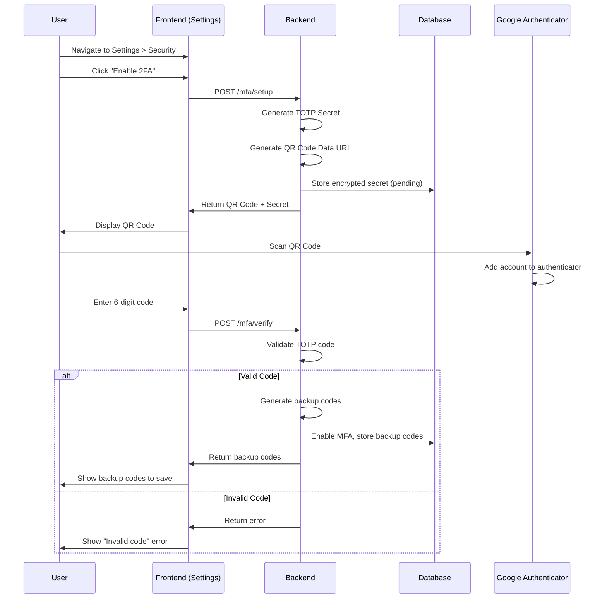
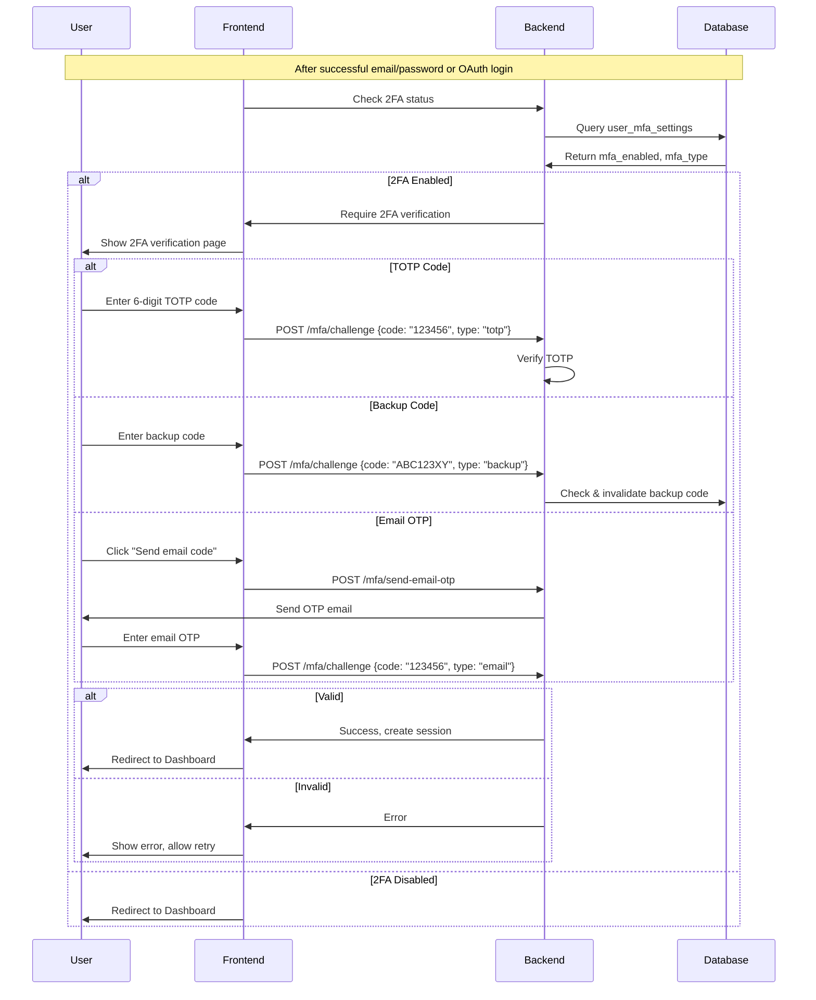
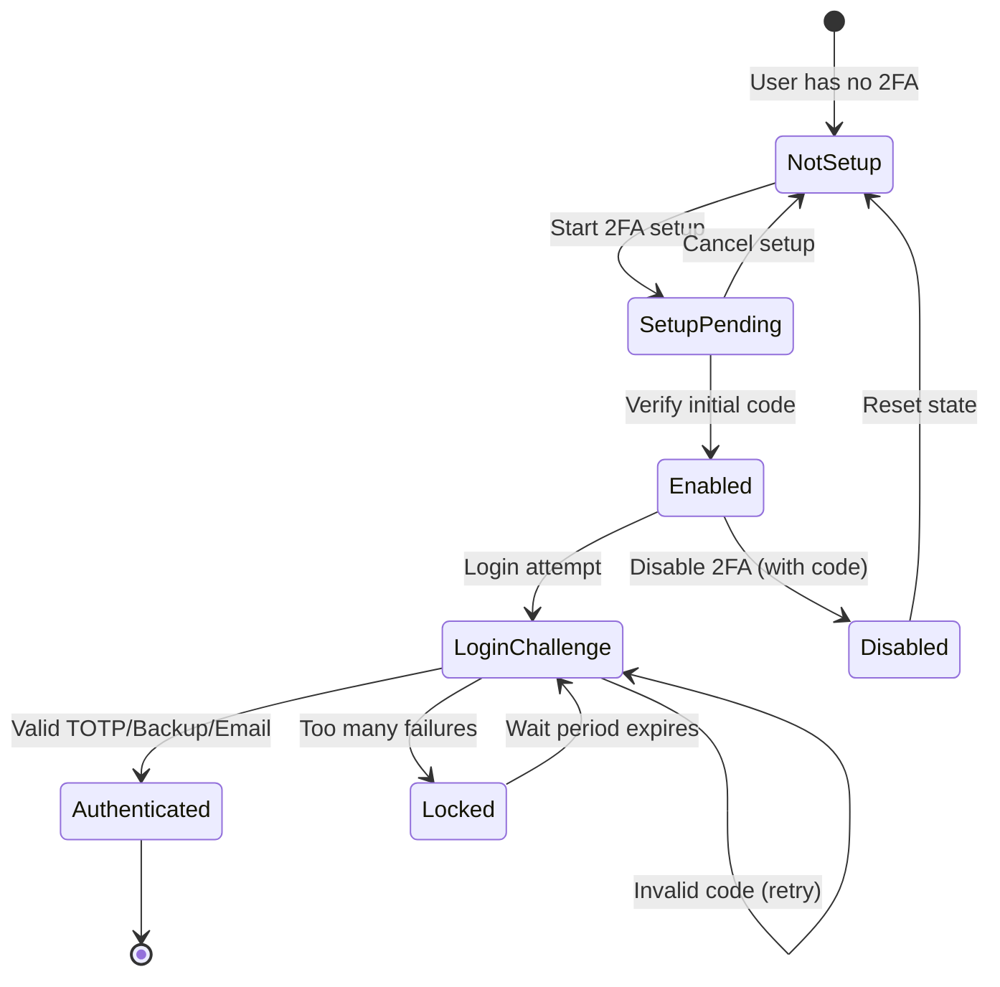
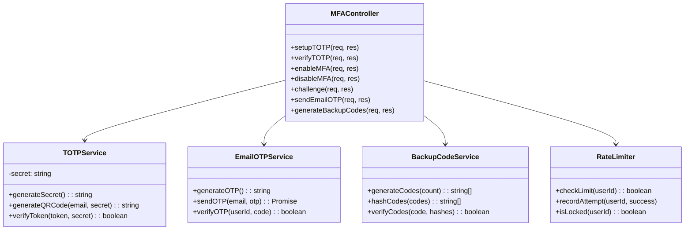
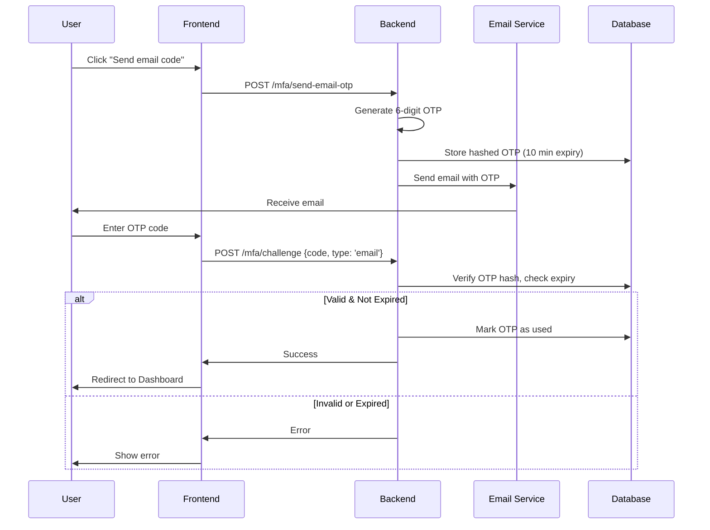
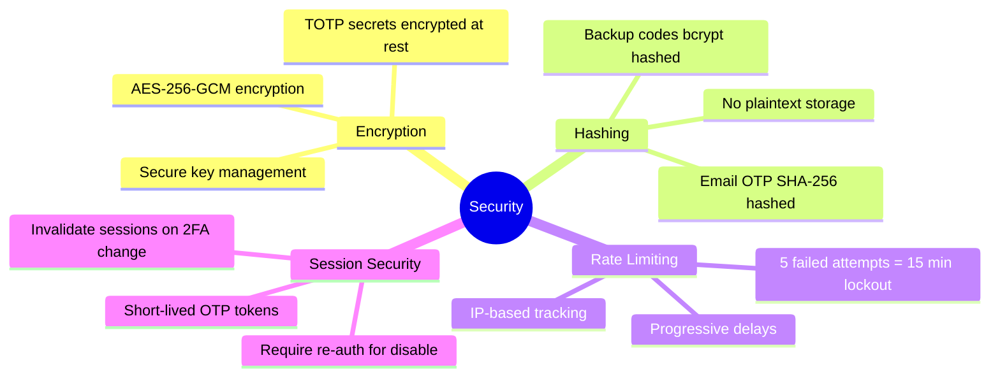

# Authentication Enhancement - Detailed Implementation Plan

## Goal

Achieve **100/100 Authentication Score** by implementing a comprehensive, production-ready authentication system with:

1. **Google OAuth** - Social login with seamless user experience
2. **TOTP 2FA** - Google Authenticator / Authy support
3. **Email OTP Fallback** - Backup verification method

---

## System Architecture Overview



---

## Current State Analysis

| Feature                   | Status | Score |
| ------------------------- | ------ | ----- |
| Email/Password login      | ✅      | 20    |
| Supabase Auth integration | ✅      | 15    |
| Session management        | ✅      | 15    |
| RLS policies              | ✅      | 15    |
| Google OAuth              | ❌      | +15   |
| TOTP 2FA                  | ❌      | +15   |
| Email OTP Fallback        | ❌      | +5    |

**Current Score: 65/100** → **Target: 100/100**

---

## Phase 1: Google OAuth Implementation (+15 points)

### 1.1 Authentication Flow Diagram



### 1.2 Component Architecture

```mermaid
graph TD
    subgraph LoginPage["Login Page Components"]
        LF[Login Form]
        GB[GoogleButton]
        DIV[Divider "or"]
    end

    subgraph AuthCallback["OAuth Callback"]
        CR[callback/route.ts]
        SE[Session Exchange]
        MFA[MFA Check]
    end

    subgraph Actions["Server Actions"]
        SIG[signInWithGoogle]
        CHK[checkMfaStatus]
    end

    LF --> GB
    GB --> SIG
    SIG --> CR
    CR --> SE
    SE --> MFA
    MFA --> |2FA Required| VF[verify-2fa/page.tsx]
    MFA --> |No 2FA| DB[Dashboard]
```

### 1.3 Files to Create/Modify

#### [NEW] [google-button.tsx](file:///c:/Users/Admin/Desktop/vulscanner/frontend/src/components/auth/google-button.tsx)

Reusable Google Sign-in button component with:
- Google brand styling (white background, Google logo)
- Loading state indicator
- Error handling display

```typescript
'use client';

import { useState } from 'react';
import { signInWithGoogle } from '@/app/(auth)/actions';

export function GoogleButton() {
  const [loading, setLoading] = useState(false);
  const [error, setError] = useState<string | null>(null);

  const handleClick = async () => {
    setLoading(true);
    setError(null);
    const result = await signInWithGoogle();
    if (result?.error) {
      setError(result.error);
      setLoading(false);
    } else if (result?.url) {
      window.location.href = result.url;
    }
  };

  return (
    <button
      onClick={handleClick}
      disabled={loading}
      className="google-signin-button"
    >
      <GoogleIcon />
      {loading ? 'Connecting...' : 'Continue with Google'}
    </button>
  );
}
```

#### [MODIFY] [actions.ts](file:///c:/Users/Admin/Desktop/vulscanner/frontend/src/app/(auth)/actions.ts)

Add Google OAuth server action:

```typescript
export async function signInWithGoogle() {
  const supabase = createClient();
  
  const { data, error } = await supabase.auth.signInWithOAuth({
    provider: 'google',
    options: {
      redirectTo: `${process.env.NEXT_PUBLIC_SITE_URL}/auth/callback`,
      queryParams: {
        access_type: 'offline',
        prompt: 'consent',
      },
    },
  });

  if (error) return { error: error.message };
  return { url: data.url };
}
```

#### [NEW] [callback/route.ts](file:///c:/Users/Admin/Desktop/vulscanner/frontend/src/app/auth/callback/route.ts)

OAuth callback handler:

```typescript
import { createClient } from '@/utils/supabase/server';
import { NextResponse } from 'next/server';

export async function GET(request: Request) {
  const { searchParams, origin } = new URL(request.url);
  const code = searchParams.get('code');
  const next = searchParams.get('next') ?? '/dashboard';

  if (code) {
    const supabase = createClient();
    const { error } = await supabase.auth.exchangeCodeForSession(code);
    
    if (!error) {
      // Check if user has 2FA enabled
      const { data: mfaSettings } = await supabase
        .from('user_mfa_settings')
        .select('mfa_enabled')
        .single();

      if (mfaSettings?.mfa_enabled) {
        return NextResponse.redirect(`${origin}/verify-2fa`);
      }
      return NextResponse.redirect(`${origin}${next}`);
    }
  }

  return NextResponse.redirect(`${origin}/login?error=auth_callback_error`);
}
```

#### [MODIFY] [login/page.tsx](file:///c:/Users/Admin/Desktop/vulscanner/frontend/src/app/(auth)/login/page.tsx)

Add Google button to login form with divider.

---

## Phase 2: TOTP 2FA Implementation (+15 points)

### 2.1 2FA Setup Flow Diagram



### 2.2 2FA Verification Flow (Login)



### 2.3 State Machine for 2FA



### 2.4 Database Schema

#### [NEW] [mfa_setup.sql](file:///c:/Users/Admin/Desktop/vulscanner/backend/supabase/mfa_setup.sql)

```sql
-- ============================================
-- MFA Settings Table
-- ============================================
CREATE TABLE IF NOT EXISTS user_mfa_settings (
    id UUID PRIMARY KEY DEFAULT gen_random_uuid(),
    user_id UUID NOT NULL REFERENCES auth.users(id) ON DELETE CASCADE,
    
    -- MFA Status
    mfa_enabled BOOLEAN DEFAULT false,
    mfa_type TEXT CHECK (mfa_type IN ('totp', 'email', 'both')) DEFAULT NULL,
    
    -- TOTP Configuration (encrypted)
    totp_secret TEXT,
    totp_verified_at TIMESTAMPTZ,
    
    -- Backup Codes (hashed)
    backup_codes TEXT[],
    backup_codes_generated_at TIMESTAMPTZ,
    backup_codes_used INTEGER DEFAULT 0,
    
    -- Rate Limiting
    failed_attempts INTEGER DEFAULT 0,
    last_failed_at TIMESTAMPTZ,
    locked_until TIMESTAMPTZ,
    
    -- Timestamps
    created_at TIMESTAMPTZ DEFAULT now(),
    updated_at TIMESTAMPTZ DEFAULT now(),
    
    CONSTRAINT unique_user_mfa UNIQUE(user_id)
);

-- ============================================
-- Email OTP Codes Table
-- ============================================
CREATE TABLE IF NOT EXISTS email_otp_codes (
    id UUID PRIMARY KEY DEFAULT gen_random_uuid(),
    user_id UUID NOT NULL REFERENCES auth.users(id) ON DELETE CASCADE,
    code_hash TEXT NOT NULL,
    expires_at TIMESTAMPTZ NOT NULL,
    used BOOLEAN DEFAULT false,
    created_at TIMESTAMPTZ DEFAULT now()
);

-- Indexes
CREATE INDEX idx_mfa_user_id ON user_mfa_settings(user_id);
CREATE INDEX idx_otp_user_id ON email_otp_codes(user_id);
CREATE INDEX idx_otp_expires ON email_otp_codes(expires_at);

-- ============================================
-- Row Level Security
-- ============================================
ALTER TABLE user_mfa_settings ENABLE ROW LEVEL SECURITY;
ALTER TABLE email_otp_codes ENABLE ROW LEVEL SECURITY;

-- Users can only view their own MFA settings
CREATE POLICY "Users can view own MFA settings"
ON user_mfa_settings FOR SELECT
USING (auth.uid() = user_id);

-- Users can update their own MFA settings
CREATE POLICY "Users can update own MFA settings"
ON user_mfa_settings FOR UPDATE
USING (auth.uid() = user_id);

-- Users can insert their own MFA settings
CREATE POLICY "Users can insert own MFA settings"
ON user_mfa_settings FOR INSERT
WITH CHECK (auth.uid() = user_id);

-- OTP codes policies
CREATE POLICY "Users can manage own OTP codes"
ON email_otp_codes FOR ALL
USING (auth.uid() = user_id);

-- ============================================
-- Auto-update timestamp trigger
-- ============================================
CREATE OR REPLACE FUNCTION update_mfa_timestamp()
RETURNS TRIGGER AS $$
BEGIN
    NEW.updated_at = now();
    RETURN NEW;
END;
$$ LANGUAGE plpgsql;

CREATE TRIGGER mfa_updated_at
    BEFORE UPDATE ON user_mfa_settings
    FOR EACH ROW
    EXECUTE FUNCTION update_mfa_timestamp();

-- ============================================
-- Cleanup expired OTP codes function
-- ============================================
CREATE OR REPLACE FUNCTION cleanup_expired_otp_codes()
RETURNS void AS $$
BEGIN
    DELETE FROM email_otp_codes WHERE expires_at < now();
END;
$$ LANGUAGE plpgsql;
```

### 2.5 Backend MFA Service Architecture



#### [NEW] [mfa.ts](file:///c:/Users/Admin/Desktop/vulscanner/backend/src/routes/mfa.ts)

```typescript
import express from 'express';
import { authenticator } from 'otplib';
import QRCode from 'qrcode';
import crypto from 'crypto';
import { supabase } from '../lib/supabase';
import { authMiddleware } from '../middleware/auth';

const router = express.Router();

// All routes require authentication
router.use(authMiddleware);

// POST /mfa/setup - Generate TOTP secret and QR code
router.post('/setup', async (req, res) => {
  const userId = req.user.id;
  const email = req.user.email;

  // Generate secret
  const secret = authenticator.generateSecret();
  
  // Generate QR code
  const otpauth = authenticator.keyuri(email, 'VulnScanner', secret);
  const qrCodeDataUrl = await QRCode.toDataURL(otpauth);

  // Store pending secret (encrypted)
  await supabase.from('user_mfa_settings').upsert({
    user_id: userId,
    totp_secret: encryptSecret(secret),
    mfa_enabled: false,
  });

  res.json({ 
    qrCode: qrCodeDataUrl, 
    secret: secret, // For manual entry
    message: 'Scan QR code with authenticator app' 
  });
});

// POST /mfa/verify - Verify TOTP during setup
router.post('/verify', async (req, res) => {
  const { code } = req.body;
  const userId = req.user.id;

  const { data: settings } = await supabase
    .from('user_mfa_settings')
    .select('totp_secret')
    .eq('user_id', userId)
    .single();

  const secret = decryptSecret(settings.totp_secret);
  const isValid = authenticator.verify({ token: code, secret });

  if (!isValid) {
    return res.status(400).json({ error: 'Invalid code' });
  }

  // Generate backup codes
  const backupCodes = generateBackupCodes(8);
  const hashedCodes = backupCodes.map(c => hashCode(c));

  // Enable MFA
  await supabase.from('user_mfa_settings').update({
    mfa_enabled: true,
    mfa_type: 'totp',
    totp_verified_at: new Date().toISOString(),
    backup_codes: hashedCodes,
    backup_codes_generated_at: new Date().toISOString(),
  }).eq('user_id', userId);

  res.json({ 
    success: true, 
    backupCodes,
    message: 'Save these backup codes in a safe place' 
  });
});

// POST /mfa/challenge - Verify code during login
router.post('/challenge', async (req, res) => {
  const { code, type } = req.body; // type: 'totp' | 'backup' | 'email'
  const userId = req.user.id;

  // Rate limiting check
  const isLocked = await checkRateLimit(userId);
  if (isLocked) {
    return res.status(429).json({ 
      error: 'Too many attempts. Try again later.' 
    });
  }

  let isValid = false;

  switch (type) {
    case 'totp':
      isValid = await verifyTOTP(userId, code);
      break;
    case 'backup':
      isValid = await verifyBackupCode(userId, code);
      break;
    case 'email':
      isValid = await verifyEmailOTP(userId, code);
      break;
  }

  await recordAttempt(userId, isValid);

  if (!isValid) {
    return res.status(400).json({ error: 'Invalid code' });
  }

  res.json({ success: true });
});

// POST /mfa/send-email-otp - Send OTP via email
router.post('/send-email-otp', async (req, res) => {
  const userId = req.user.id;
  const email = req.user.email;

  const otp = generateOTP(6);
  const expiresAt = new Date(Date.now() + 10 * 60 * 1000); // 10 minutes

  await supabase.from('email_otp_codes').insert({
    user_id: userId,
    code_hash: hashCode(otp),
    expires_at: expiresAt.toISOString(),
  });

  // Send email via Supabase Edge Function or SMTP
  await sendOTPEmail(email, otp);

  res.json({ message: 'OTP sent to your email' });
});

export default router;
```

### 2.6 Frontend Components

#### [NEW] [setup-2fa/page.tsx](file:///c:/Users/Admin/Desktop/vulscanner/frontend/src/app/(dashboard)/settings/setup-2fa/page.tsx)

2FA Setup wizard with:
- Step 1: Show QR code
- Step 2: Verify code input
- Step 3: Display backup codes

#### [NEW] [verify-2fa/page.tsx](file:///c:/Users/Admin/Desktop/vulscanner/frontend/src/app/(auth)/verify-2fa/page.tsx)

2FA challenge page during login:
- 6-digit TOTP input with auto-focus
- "Use backup code" option
- "Send email code" fallback button

#### [NEW] [totp-input.tsx](file:///c:/Users/Admin/Desktop/vulscanner/frontend/src/components/auth/totp-input.tsx)

Reusable 6-digit code input component:
- Auto-focus on next input
- Paste support for full code
- Auto-submit on complete

---

## Phase 3: Email OTP Fallback (+5 points)

### 3.1 Email OTP Flow



### 3.2 Email Template

```html
<!DOCTYPE html>
<html>
<head>
    <style>
        .container { max-width: 600px; margin: 0 auto; font-family: Arial; }
        .code { font-size: 32px; font-weight: bold; color: #4F46E5; 
                letter-spacing: 8px; padding: 20px; background: #F3F4F6; 
                text-align: center; border-radius: 8px; }
        .warning { color: #DC2626; font-size: 12px; }
    </style>
</head>
<body>
    <div class="container">
        <h2>Your VulnScanner Verification Code</h2>
        <div class="code">{{OTP_CODE}}</div>
        <p>This code expires in 10 minutes.</p>
        <p class="warning">If you didn't request this code, please ignore this email.</p>
    </div>
</body>
</html>
```

---

## Complete File Summary

### New Files (9 files)

| File | Purpose | Priority |
|------|---------|----------|
| [google-button.tsx](file:///c:/Users/Admin/Desktop/vulscanner/frontend/src/components/auth/google-button.tsx) | Google OAuth button component | Phase 1 |
| [callback/route.ts](file:///c:/Users/Admin/Desktop/vulscanner/frontend/src/app/auth/callback/route.ts) | OAuth callback handler | Phase 1 |
| [mfa.ts](file:///c:/Users/Admin/Desktop/vulscanner/backend/src/routes/mfa.ts) | MFA API routes | Phase 2 |
| [mfa_setup.sql](file:///c:/Users/Admin/Desktop/vulscanner/backend/supabase/mfa_setup.sql) | Database schema | Phase 2 |
| [setup-2fa/page.tsx](file:///c:/Users/Admin/Desktop/vulscanner/frontend/src/app/(dashboard)/settings/setup-2fa/page.tsx) | 2FA setup wizard | Phase 2 |
| [verify-2fa/page.tsx](file:///c:/Users/Admin/Desktop/vulscanner/frontend/src/app/(auth)/verify-2fa/page.tsx) | 2FA verification page | Phase 2 |
| [totp-input.tsx](file:///c:/Users/Admin/Desktop/vulscanner/frontend/src/components/auth/totp-input.tsx) | 6-digit code input | Phase 2 |
| [mfa-service.ts](file:///c:/Users/Admin/Desktop/vulscanner/backend/src/lib/mfa-service.ts) | MFA business logic | Phase 2 |
| [email-templates/otp.html](file:///c:/Users/Admin/Desktop/vulscanner/backend/src/templates/otp.html) | OTP email template | Phase 3 |

### Modified Files (5 files)

| File | Changes |
|------|---------|
| [actions.ts](file:///c:/Users/Admin/Desktop/vulscanner/frontend/src/app/(auth)/actions.ts) | Add `signInWithGoogle`, `checkMfaStatus` actions |
| [login/page.tsx](file:///c:/Users/Admin/Desktop/vulscanner/frontend/src/app/(auth)/login/page.tsx) | Add Google button, 2FA redirect logic |
| [index.ts](file:///c:/Users/Admin/Desktop/vulscanner/backend/src/index.ts) | Register MFA routes |
| [package.json](file:///c:/Users/Admin/Desktop/vulscanner/backend/package.json) | Add `otplib`, `qrcode` dependencies |
| [settings/page.tsx](file:///c:/Users/Admin/Desktop/vulscanner/frontend/src/app/(dashboard)/settings/page.tsx) | Add security section with 2FA toggle |

---

## Security Considerations



---

## Environment Variables

```env
# Frontend (.env.local)
NEXT_PUBLIC_SITE_URL=http://localhost:3000

# Backend (.env)
MFA_ENCRYPTION_KEY=your-32-byte-encryption-key
SMTP_HOST=smtp.example.com
SMTP_PORT=587
SMTP_USER=noreply@vulnscanner.tech
SMTP_PASS=your-smtp-password
```

---

## Verification Plan

### Automated Tests

The project has Playwright tests in `tests/` directory. We'll add:

```bash
# Run existing tests
npm run test:e2e

# New test file to create: tests/e2e/auth.spec.ts
```

**Test cases to implement:**
1. Google OAuth redirect flow
2. 2FA setup complete flow
3. 2FA login verification
4. Email OTP send and verify
5. Backup code usage

### Manual Verification

1. **Google OAuth Test**
   - Navigate to `/login`
   - Click "Continue with Google"
   - Complete Google sign-in
   - Verify redirect to dashboard

2. **TOTP 2FA Setup Test**
   - Navigate to Settings > Security
   - Click "Enable 2FA"
   - Scan QR with Google Authenticator
   - Enter 6-digit code
   - Verify backup codes displayed

3. **2FA Login Test**
   - Logout
   - Login with email/password
   - Verify redirect to `/verify-2fa`
   - Enter TOTP code
   - Verify access to dashboard

4. **Email OTP Test**
   - On 2FA page, click "Email me a code"
   - Check email for OTP
   - Enter code
   - Verify access granted

---

## Estimated Timeline

| Phase | Task | Duration |
|-------|------|----------|
| 1 | Google OAuth setup (Supabase config) | 15 min |
| 1 | Frontend Google button + callback | 45 min |
| 2 | Database schema + migration | 20 min |
| 2 | Backend MFA routes | 1.5 hours |
| 2 | Frontend 2FA setup page | 45 min |
| 2 | Frontend 2FA verify page | 45 min |
| 3 | Email OTP service | 30 min |
| - | Testing & debugging | 45 min |
| **Total** | | **~5.5 hours** |

---

> [!IMPORTANT]  
> **Prerequisites before implementation:**
> 1. Configure Google OAuth in Supabase Dashboard
> 2. Set up SMTP credentials for email OTP
> 3. Generate and securely store MFA encryption key
