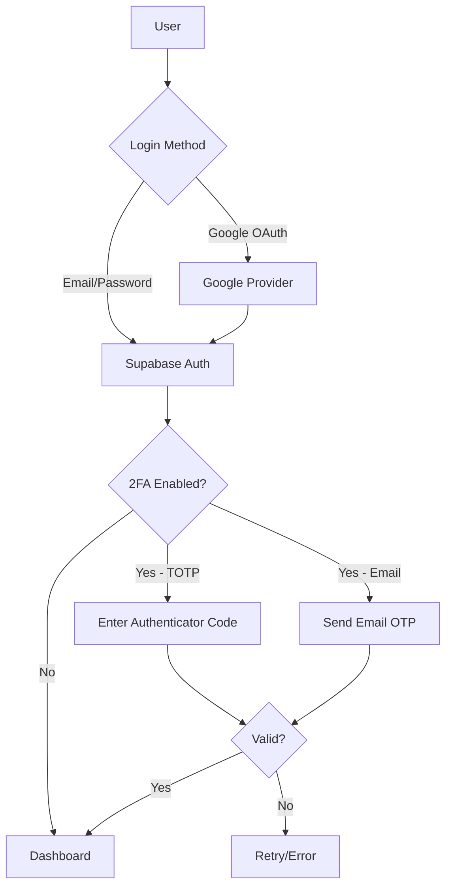

# Authentication Enhancement Implementation Plan

## Goal

Achieve **100/100 Authentication Score** by implementing:

1. **Google OAuth** - Social login option
2. **TOTP 2FA** - Google Authenticator support
3. **Email OTP Fallback** - For users without 2FA setup

---

## Current Authentication: 65/100

| Feature                   | Status |
| ------------------------- | ------ |
| Email/Password login      | ✅     |
| Supabase Auth integration | ✅     |
| Session management        | ✅     |
| RLS policies              | ✅     |
| Google OAuth              | ❌     |
| 2FA/MFA                   | ❌     |
| Email OTP                 | ❌     |

---

## Architecture Overview



---

## Phase 1: Google OAuth (+15 points)

### 1.1 Supabase Configuration (Manual Step)

> [!IMPORTANT]
> **Prerequisite**: Configure Google OAuth in Supabase Dashboard:
>
> 1. Go to **Authentication → Providers → Google**
> 2. Enable Google provider
> 3. Add OAuth credentials from [Google Cloud Console](https://console.cloud.google.com/)
> 4. Set redirect URL: `https://your-project.supabase.co/auth/v1/callback`

### 1.2 Frontend Changes

#### [MODIFY] [actions.ts](<file:///c:/Users/Admin/Desktop/vulscanner/frontend/src/app/(auth)/actions.ts>)

```typescript
// Add Google OAuth action
export async function signInWithGoogle() {
  const supabase = createClient();
  const { data, error } = await supabase.auth.signInWithOAuth({
    provider: 'google',
    options: {
      redirectTo: `${process.env.NEXT_PUBLIC_SITE_URL}/auth/callback`,
    },
  });
  if (error) return { error: error.message };
  return { url: data.url };
}
```

#### [NEW] [callback/route.ts](file:///c:/Users/Admin/Desktop/vulscanner/frontend/src/app/auth/callback/route.ts)

```typescript
// OAuth callback handler
// Exchange code for session
// Redirect to dashboard or 2FA verification
```

#### [MODIFY] [login/page.tsx](<file:///c:/Users/Admin/Desktop/vulscanner/frontend/src/app/(auth)/login/page.tsx>)

- Add "Sign in with Google" button
- Handle OAuth redirect

---

## Phase 2: TOTP 2FA - Google Authenticator (+15 points)

### 2.1 Database Schema

#### [NEW] [mfa_setup.sql](file:///c:/Users/Admin/Desktop/vulscanner/backend/supabase/mfa_setup.sql)

```sql
-- User MFA settings table
CREATE TABLE user_mfa_settings (
  id UUID PRIMARY KEY DEFAULT gen_random_uuid(),
  user_id UUID REFERENCES auth.users(id) ON DELETE CASCADE,
  mfa_enabled BOOLEAN DEFAULT false,
  mfa_type TEXT CHECK (mfa_type IN ('totp', 'email', 'both')),
  totp_secret TEXT, -- Encrypted
  backup_codes TEXT[], -- Encrypted
  created_at TIMESTAMPTZ DEFAULT now(),
  updated_at TIMESTAMPTZ DEFAULT now(),
  UNIQUE(user_id)
);

-- Enable RLS
ALTER TABLE user_mfa_settings ENABLE ROW LEVEL SECURITY;

CREATE POLICY "Users can view own MFA settings"
ON user_mfa_settings FOR SELECT
USING (auth.uid() = user_id);

CREATE POLICY "Users can update own MFA settings"
ON user_mfa_settings FOR UPDATE
USING (auth.uid() = user_id);
```

### 2.2 Backend MFA Routes

#### [NEW] [mfa.ts](file:///c:/Users/Admin/Desktop/vulscanner/backend/src/routes/mfa.ts)

```typescript
// POST /mfa/setup - Generate TOTP secret & QR code
// POST /mfa/verify - Verify TOTP code during setup
// POST /mfa/enable - Enable 2FA after verification
// POST /mfa/disable - Disable 2FA (requires current code)
// POST /mfa/challenge - Verify code during login
// POST /mfa/backup-codes - Generate new backup codes
```

#### [MODIFY] [package.json](file:///c:/Users/Admin/Desktop/vulscanner/backend/package.json)

```bash
npm install otplib qrcode
npm install -D @types/qrcode
```

### 2.3 Frontend 2FA Components

#### [NEW] [setup-2fa/page.tsx](<file:///c:/Users/Admin/Desktop/vulscanner/frontend/src/app/(dashboard)/settings/setup-2fa/page.tsx>)

- Display QR code for Google Authenticator
- Input field for verification code
- Show backup codes after setup

#### [NEW] [verify-2fa/page.tsx](<file:///c:/Users/Admin/Desktop/vulscanner/frontend/src/app/(auth)/verify-2fa/page.tsx>)

- 2FA challenge page during login
- 6-digit code input
- "Use backup code" option
- "Send email code instead" fallback

---

## Phase 3: Email OTP Fallback (+5 points)

### 3.1 Email OTP Flow

#### [MODIFY] [mfa.ts](file:///c:/Users/Admin/Desktop/vulscanner/backend/src/routes/mfa.ts)

```typescript
// POST /mfa/send-email-otp - Send OTP to user's email
// Uses Supabase's built-in email sending
```

#### [MODIFY] [verify-2fa/page.tsx]

- Add "Email me a code instead" button
- Toggle between TOTP and Email OTP input

---

## Implementation Files Summary

### New Files (7 files)

| File                                                                                                                         | Purpose                |
| ---------------------------------------------------------------------------------------------------------------------------- | ---------------------- |
| [frontend/src/app/auth/callback/route.ts](file:///c:/Users/Admin/Desktop/vulscanner/frontend/src/app/auth/callback/route.ts) | OAuth callback handler |
| `frontend/src/app/(auth)/verify-2fa/page.tsx`                                                                                | 2FA verification page  |
| `frontend/src/app/(dashboard)/settings/setup-2fa/page.tsx`                                                                   | 2FA setup page         |
| `frontend/src/components/auth/google-button.tsx`                                                                             | Google sign-in button  |
| `frontend/src/components/auth/totp-input.tsx`                                                                                | 6-digit code input     |
| `backend/src/routes/mfa.ts`                                                                                                  | MFA API routes         |
| `backend/supabase/mfa_setup.sql`                                                                                             | MFA database schema    |

### Modified Files (4 files)

| File                                                                                                                           | Changes                        |
| ------------------------------------------------------------------------------------------------------------------------------ | ------------------------------ |
| [frontend/src/app/(auth)/actions.ts](file:///c:/Users/Admin/Desktop/vulscanner/frontend/src/app/%28auth%29/actions.ts)         | Add Google OAuth & 2FA actions |
| [frontend/src/app/(auth)/login/page.tsx](file:///c:/Users/Admin/Desktop/vulscanner/frontend/src/app/%28auth%29/login/page.tsx) | Google button, 2FA redirect    |
| [backend/src/index.ts](file:///c:/Users/Admin/Desktop/vulscanner/backend/src/index.ts)                                         | Register MFA routes            |
| [backend/package.json](file:///c:/Users/Admin/Desktop/vulscanner/backend/package.json)                                         | Add otplib, qrcode deps        |

---

## User Flow Diagrams

### 2FA Setup Flow

```
Settings → Security → Enable 2FA
    ↓
Show QR Code (scan with Google Authenticator)
    ↓
Enter 6-digit code to verify
    ↓
Show backup codes (save these!)
    ↓
2FA Enabled ✅
```

### Login with 2FA Flow

```
Enter email/password OR Google OAuth
    ↓
Check if user has 2FA enabled
    ↓
[Yes] → Redirect to /verify-2fa
        ↓
    Enter TOTP code OR Request email OTP
        ↓
    Verify code → Dashboard

[No] → Direct to Dashboard
```

---

## Verification Plan

### Manual Testing

1. **Google OAuth**: Click "Sign in with Google" → Complete OAuth → Verify session
2. **TOTP Setup**: Go to Settings → Enable 2FA → Scan QR → Verify code
3. **TOTP Login**: Logout → Login → Enter TOTP code → Verify access
4. **Email Fallback**: On 2FA page → Click "Email me a code" → Enter code
5. **Backup Codes**: Use backup code instead of TOTP → Verify access

### Security Checks

- [ ] TOTP secrets encrypted at rest
- [ ] Backup codes hashed
- [ ] Rate limiting on verification attempts
- [ ] Session invalidation after 2FA changes

---

## Estimated Time

| Phase     | Item                  | Time           |
| --------- | --------------------- | -------------- |
| 1         | Google OAuth          | 45 min         |
| 2         | TOTP 2FA Setup        | 1.5 hours      |
| 2         | 2FA Verification Flow | 1 hour         |
| 3         | Email OTP Fallback    | 30 min         |
| -         | Testing & Polish      | 45 min         |
| **Total** |                       | **~4.5 hours** |

---

## Environment Variables Needed

```env
# Frontend (.env.local)
NEXT_PUBLIC_SITE_URL=http://localhost:3000  # For OAuth redirect

# Backend (.env)
# Supabase handles email sending, no additional config needed
```
