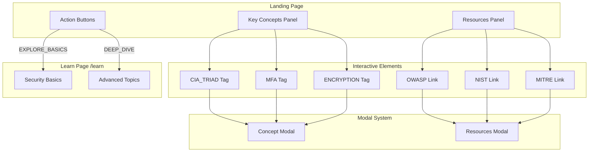
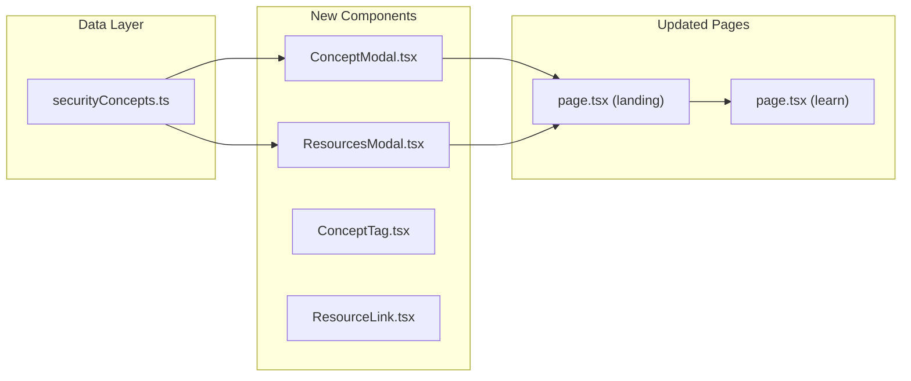
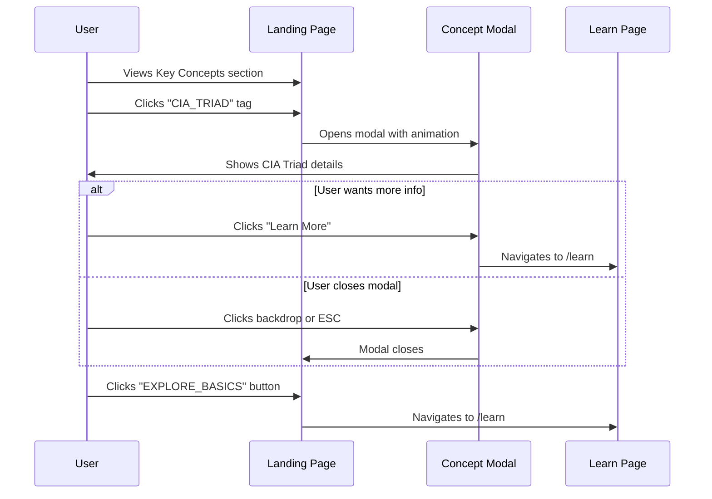

# Explorable Security Knowledge Section

Transform the static "Key Concepts" and "Resources" section into an interactive learning experience where users can explore security topics in-depth.

## Architecture Overview



## Component Structure



---

## Proposed Changes

### Component: ConceptModal
> Modal displaying detailed information about security concepts

#### [NEW] [ConceptModal.tsx](file:///c:/Users/Admin/Desktop/vulscanner/frontend/src/components/landing/ConceptModal.tsx)

**Features:**
- Animated slide-in modal with glassmorphism design
- Concept title, description, and key points
- Visual diagram/icon for each concept
- "Learn More" link to `/learn` page
- Close on backdrop click or ESC key

---

### Component: Interactive Tags
> Clickable concept tags that open modals

#### [MODIFY] [page.tsx](file:///c:/Users/Admin/Desktop/vulscanner/frontend/src/app/(marketing)/page.tsx)

**Changes:**
- Convert static `<span>` tags to clickable `<button>` elements
- Add `onClick` handlers to open concept modals
- Add hover animations for visual feedback
- Wire EXPLORE_BASICS → `/learn#basics`
- Wire DEEP_DIVE → `/learn#advanced`

---

### Data: Security Concepts Content

#### [NEW] [securityConcepts.ts](file:///c:/Users/Admin/Desktop/vulscanner/frontend/src/data/securityConcepts.ts)

```typescript
// Example structure
export const concepts = {
  CIA_TRIAD: {
    title: "CIA Triad",
    subtitle: "Confidentiality, Integrity, Availability",
    description: "The foundational model for information security...",
    keyPoints: ["Confidentiality", "Integrity", "Availability"],
    icon: "security",
    learnMoreUrl: "/learn#cia-triad"
  },
  // MFA, ENCRYPTION...
}

export const resources = {
  OWASP: { name: "OWASP", url: "https://owasp.org", description: "..." },
  NIST: { name: "NIST", url: "https://nist.gov", description: "..." },
  MITRE: { name: "MITRE ATT&CK", url: "https://attack.mitre.org", description: "..." }
}
```

---

## User Interaction Flow



---

## Verification Plan

### Interactive Testing
- Click each concept tag → modal opens with correct content
- Close modal via backdrop click and ESC key
- EXPLORE_BASICS navigates to `/learn#basics`
- DEEP_DIVE navigates to `/learn#advanced`
- Resource links open in new tabs

### Visual Testing
- Modal animations are smooth (300ms transitions)
- Responsive on mobile, tablet, desktop
- Glassmorphism effect consistent with design
