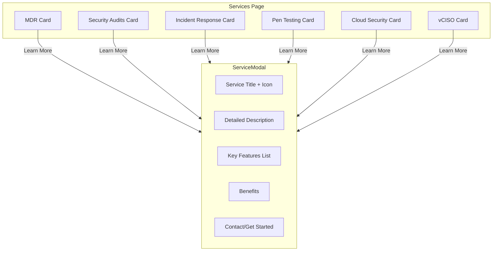
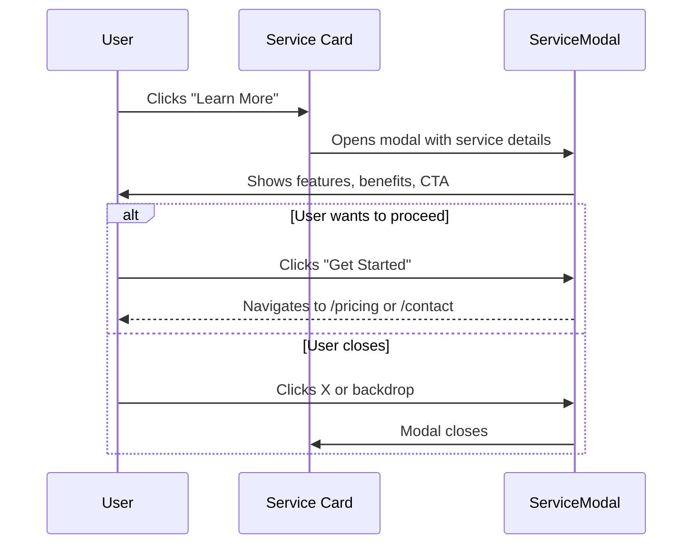

# Explorable Services Section

Make the "Learn More" buttons on the Services page open detailed modals with comprehensive service information.

## Architecture Overview

---

## Proposed Changes

### Data Layer

#### [NEW] [servicesData.ts](file:///c:/Users/Admin/Desktop/vulscanner/frontend/src/data/servicesData.ts)

| Service ID | Title |
|------------|-------|
| mdr | Managed Detection & Response |
| audits | Security Audits & Compliance |
| incident | Incident Response |
| pentest | Penetration Testing |
| cloud | Cloud Security Architecture |
| vciso | Virtual CISO (vCISO) |

Each service includes: [id](file:///c:/Users/Admin/Desktop/vulscanner/frontend/src/components/landing/VideoModal.tsx#11-92), `title`, `icon`, `shortDescription`, `fullDescription`, `features[]`, `benefits[]`, `ctaText`

---

### Component

#### [NEW] [ServiceModal.tsx](file:///c:/Users/Admin/Desktop/vulscanner/frontend/src/components/services/ServiceModal.tsx)

Modal with:
- Service icon and title
- Full description
- Key features checklist
- Benefits section
- CTA button → Contact page or pricing

---

### Services Page

#### [MODIFY] [page.tsx](file:///c:/Users/Admin/Desktop/vulscanner/frontend/src/app/(marketing)/services/page.tsx)

- Add `'use client'` directive
- Add `selectedService` state
- Convert `<a href="#">` to `<button onClick={...}>`
- Import and render `ServiceModal`

---

## User Interaction Flow

---

## Verification Plan

- Click each of the 6 "Learn More" buttons → modal opens with correct content
- Close modal via X button, backdrop, or ESC key
- Verify CTA button navigates correctly
