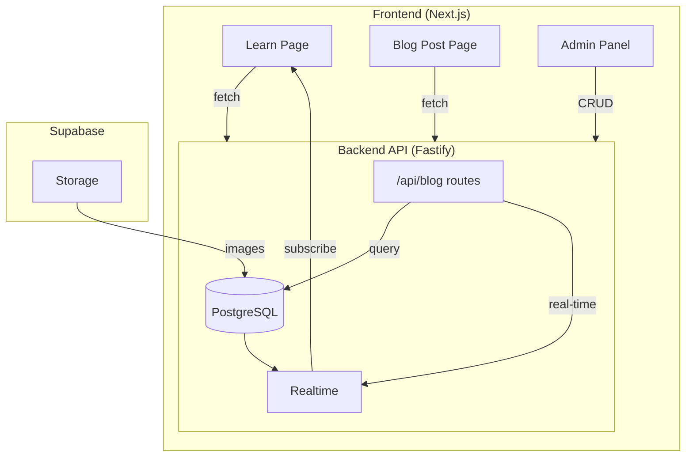

# Learn Page Blog System - Implementation Plan

## Overview

Transform the static Learn/Security Academy page into a dynamic blog system with:
- Real-time content updates
- Admin blog management
- Category filtering
- Pagination
- Featured articles

---

## Architecture Diagram



---

## Database Schema

### New Tables in Supabase

```sql
-- Blog Posts table
CREATE TABLE blog_posts (
    id UUID PRIMARY KEY DEFAULT gen_random_uuid(),
    slug VARCHAR(255) UNIQUE NOT NULL,
    title VARCHAR(255) NOT NULL,
    excerpt TEXT,
    content TEXT NOT NULL,
    cover_image VARCHAR(500),
    category VARCHAR(50) NOT NULL,
    tags TEXT[],
    author_id UUID REFERENCES profiles(id),
    read_time INT DEFAULT 5,
    is_featured BOOLEAN DEFAULT false,
    is_published BOOLEAN DEFAULT false,
    published_at TIMESTAMPTZ,
    created_at TIMESTAMPTZ DEFAULT NOW(),
    updated_at TIMESTAMPTZ DEFAULT NOW()
);

-- Blog Categories table
CREATE TABLE blog_categories (
    id UUID PRIMARY KEY DEFAULT gen_random_uuid(),
    name VARCHAR(100) NOT NULL,
    slug VARCHAR(100) UNIQUE NOT NULL,
    description TEXT,
    post_count INT DEFAULT 0,
    created_at TIMESTAMPTZ DEFAULT NOW()
);

-- Create indexes
CREATE INDEX idx_blog_posts_category ON blog_posts(category);
CREATE INDEX idx_blog_posts_published ON blog_posts(is_published, published_at DESC);
CREATE INDEX idx_blog_posts_featured ON blog_posts(is_featured) WHERE is_featured = true;
```

---

## Proposed Changes

### Backend (Fastify)

#### [NEW] [blogs.ts](file:///c:/Users/Admin/Desktop/vulscanner/backend/src/routes/blogs.ts)

New API routes:

| Method | Endpoint | Description |
|--------|----------|-------------|
| GET | `/api/blogs` | List posts (paginated, filterable) |
| GET | `/api/blogs/:slug` | Get single post |
| GET | `/api/blogs/featured` | Get featured post |
| GET | `/api/blogs/categories` | List categories with counts |
| POST | `/api/blogs` | Create post (admin) |
| PUT | `/api/blogs/:id` | Update post (admin) |
| DELETE | `/api/blogs/:id` | Delete post (admin) |

---

### Frontend

#### [NEW] [blogApi.ts](file:///c:/Users/Admin/Desktop/vulscanner/frontend/src/lib/api/blogApi.ts)

API fetchers:
- `getBlogs(page, category, search)`
- `getBlogBySlug(slug)`
- `getFeaturedBlog()`
- `getCategories()`

#### [MODIFY] [page.tsx](file:///c:/Users/Admin/Desktop/vulscanner/frontend/src/app/(marketing)/learn/page.tsx)

- Replace static articles with dynamic fetching
- Add `useEffect` for Supabase real-time subscription
- Implement category filtering state
- Add pagination controls

#### [NEW] [/learn/[slug]/page.tsx](file:///c:/Users/Admin/Desktop/vulscanner/frontend/src/app/(marketing)/learn/[slug]/page.tsx)

Individual blog post page with:
- Full article content (Markdown → HTML)
- Author info
- Related posts
- Social sharing

#### [NEW] [BlogCard.tsx](file:///c:/Users/Admin/Desktop/vulscanner/frontend/src/components/blog/BlogCard.tsx)

Reusable article card component.

#### [NEW] [FeaturedArticle.tsx](file:///c:/Users/Admin/Desktop/vulscanner/frontend/src/components/blog/FeaturedArticle.tsx)

Hero featured article component.

---

## Real-Time Updates

```typescript
// Supabase real-time subscription
useEffect(() => {
  const channel = supabase
    .channel('blog_changes')
    .on('postgres_changes', {
      event: '*',
      schema: 'public',
      table: 'blog_posts'
    }, (payload) => {
      // Refetch or update local state
      refetchBlogs();
    })
    .subscribe();
    
  return () => { supabase.removeChannel(channel); };
}, []);
```

---

## Verification Plan

### Automated Tests
```bash
# Run backend tests
cd backend && npm test

# Run frontend build
cd frontend && npm run build
```

### Manual Verification
1. Create test blog post via API/Admin
2. Verify post appears on Learn page
3. Test category filtering
4. Test pagination
5. Open second browser → create post → verify real-time update in first browser
