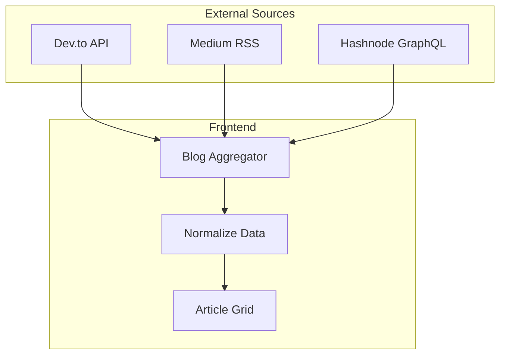

# Learn Page - Multi-Source Blog Aggregator

## Overview

Aggregate blog posts from 3 external sources into a unified Learn page:
- **Dev.to** - REST API
- **Medium** - RSS Feed
- **Hashnode** - GraphQL API



---

## User Input Required

> [!IMPORTANT]
> Please provide your usernames for each platform:
> - **Dev.to username**: `___________`
> - **Medium username**: `___________`
> - **Hashnode blog URL**: `___________`

---

## Proposed Changes

### [NEW] [blogApi.ts](file:///c:/Users/Admin/Desktop/vulscanner/frontend/src/lib/api/blogApi.ts)

Multi-source fetcher with unified data format:

```typescript
interface BlogPost {
  id: string;
  title: string;
  excerpt: string;
  coverImage: string;
  author: string;
  date: string;
  readTime: string;
  category: string;
  url: string;
  source: 'devto' | 'medium' | 'hashnode';
}
```

### [MODIFY] [page.tsx](file:///c:/Users/Admin/Desktop/vulscanner/frontend/src/app/(marketing)/learn/page.tsx)

- Fetch from all 3 sources in parallel
- Merge and sort by date
- Filter by source (sidebar)
- Pagination

---

## Verification

1. Verify Dev.to articles load
2. Verify Medium articles load
3. Verify Hashnode articles load
4. Test source filtering
5. Verify mixed sorting works
