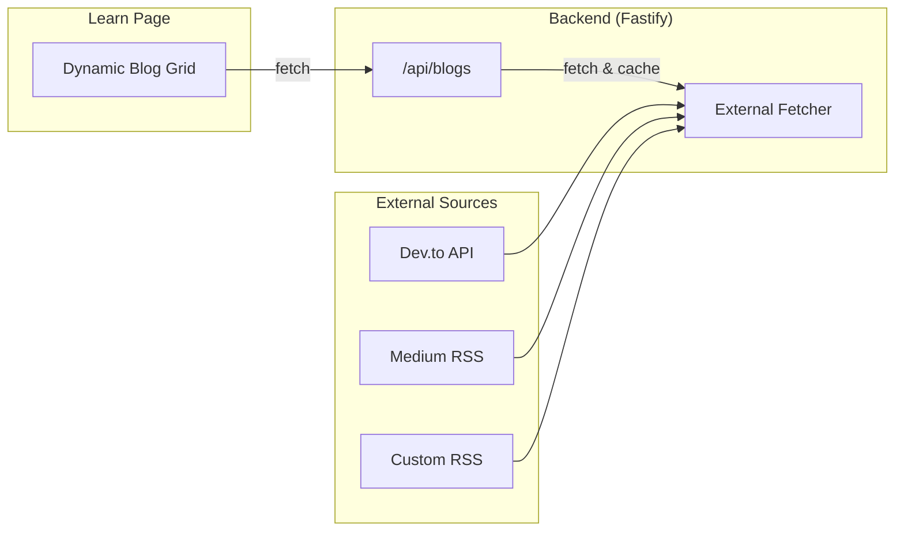

# Learn Page - External Blog Display

## Overview

Display blog posts from external sources (Dev.to, Medium, RSS feeds) on the Learn page without needing a blog management system.

---

## Architecture



---

## User Decision Required

> [!IMPORTANT]
> **Which external blog source do you want to use?**
> 1. **Dev.to** - Free API, your articles via `https://dev.to/api/articles?username=YOUR_USERNAME`
> 2. **Medium** - RSS feed `https://medium.com/feed/@YOUR_USERNAME`
> 3. **Hashnode** - GraphQL API for your blog
> 4. **Custom RSS** - Any RSS feed URL
> 5. **Static JSON** - Manually curated list of articles

---

## Proposed Changes

### Option A: Dev.to Integration (Recommended)

#### [NEW] [blogApi.ts](file:///c:/Users/Admin/Desktop/vulscanner/frontend/src/lib/api/blogApi.ts)

```typescript
const DEV_TO_USERNAME = 'your_username';

export async function getBlogs(page = 1, perPage = 10) {
  const res = await fetch(
    `https://dev.to/api/articles?username=${DEV_TO_USERNAME}&page=${page}&per_page=${perPage}`
  );
  return res.json();
}

export async function getBlogBySlug(slug: string) {
  const res = await fetch(`https://dev.to/api/articles/${slug}`);
  return res.json();
}
```

#### [MODIFY] [page.tsx](file:///c:/Users/Admin/Desktop/vulscanner/frontend/src/app/(marketing)/learn/page.tsx)

- Replace hardcoded articles with `useEffect` + `getBlogs()`
- Map API response to existing card UI
- Implement category filtering from tags

---

### Option B: Static JSON Data

#### [NEW] [blogData.ts](file:///c:/Users/Admin/Desktop/vulscanner/frontend/src/data/blogData.ts)

Manually curated articles with external links.

---

## Verification

1. Fetch articles → verify grid displays correctly
2. Click article → verify opens external link
3. Test pagination
4. Test category filtering
