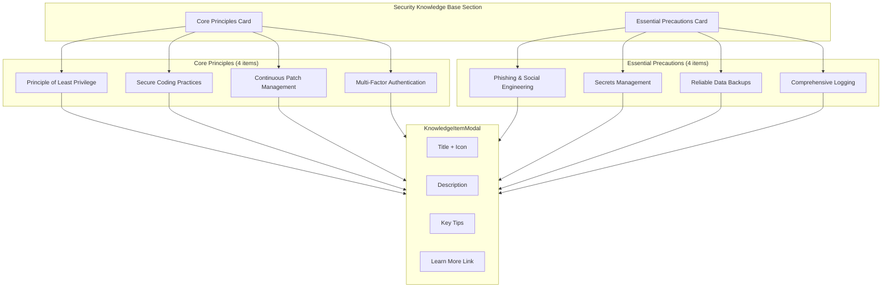
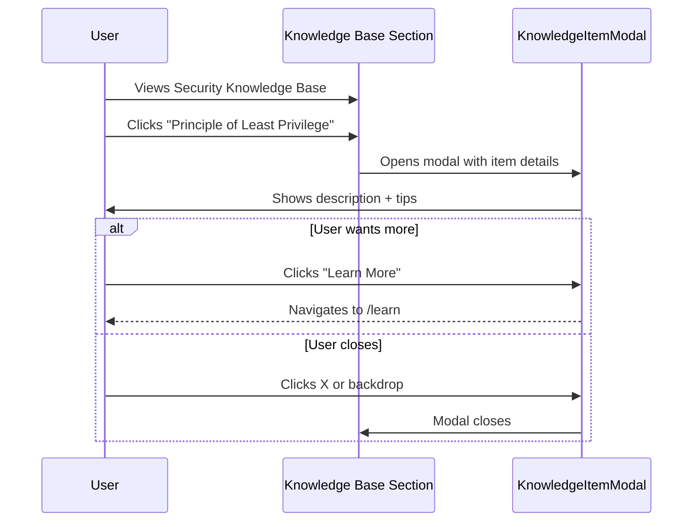

# Security Knowledge Base Exploration

Make the "Core Principles" and "Essential Precautions" section fully interactive, allowing users to click on each item to learn more.

## Architecture Overview

---

## Proposed Changes

### Data Layer

#### [MODIFY] [securityConcepts.ts](file:///c:/Users/Admin/Desktop/vulscanner/frontend/src/data/securityConcepts.ts)

Add `knowledgeItems` array with 8 items:

| ID | Category | Title |
|----|----------|-------|
| least-privilege | principle | Principle of Least Privilege |
| secure-coding | principle | Secure Coding Practices |
| patch-management | principle | Continuous Patch Management |
| mfa | principle | Multi-Factor Authentication |
| phishing | precaution | Phishing & Social Engineering |
| secrets | precaution | Secrets Management & Hygiene |
| backups | precaution | Reliable Data Backups |
| logging | precaution | Comprehensive Logging |

---

### Component

#### [NEW] [KnowledgeItemModal.tsx](file:///c:/Users/Admin/Desktop/vulscanner/frontend/src/components/landing/KnowledgeItemModal.tsx)

Reuse similar structure to [ConceptModal](file:///c:/Users/Admin/Desktop/vulscanner/frontend/src/components/landing/ConceptModal.tsx#13-108):
- Title with icon
- Description paragraph
- 3-4 actionable tips
- "Learn More" button → `/learn#[item-id]`

---

### Landing Page

#### [MODIFY] [page.tsx](file:///c:/Users/Admin/Desktop/vulscanner/frontend/src/app/(marketing)/page.tsx)

- Add `selectedKnowledgeItem` state
- Convert `<li>` elements to clickable `<button>` elements
- Add hover effects for visual feedback
- Wire up modal open/close

---

## User Interaction Flow

---

## Verification Plan

- Click each of the 8 items → modal opens with correct content
- Close modal via X button, backdrop, or ESC key
- Verify responsive layout on mobile
