# Email OTP Fix - Implementation Plan

## Problem Identified

The "Email me a code instead" feature fails because:

1. **Frontend Issue**: Missing `body: JSON.stringify({})` in POST request (Fastify requires body with JSON content-type)
2. **Backend Issue**: Uses `supabase.auth.admin.generateLink` which generates **magic links**, NOT OTP emails

```mermaid
flowchart TB
    subgraph Current[Current Broken Flow]
        A[User clicks 'Email me a code'] --> B[Frontend: POST /api/mfa/send-email-otp]
        B --> C[Backend: /mfa/send-email-otp]
        C --> D[supabase.auth.admin.generateLink]
        D --> E[❌ Generates magic link, not OTP]
        E --> F[Error or wrong email sent]
    end
```



---

## Solution

```mermaid
flowchart TB
    subgraph Fixed[Fixed Flow]
        A[User clicks 'Email me a code'] --> B[Frontend: POST /api/mfa/send-email-otp\nwith empty body]
        B --> C[Backend: /mfa/send-email-otp]
        C --> D[Generate 6-digit OTP]
        D --> E[Store hashed OTP in DB]
        E --> F{Email Service?}
        F -->|Development| G[Log OTP to console]
        F -->|Production| H[Send via Resend/SMTP]
        G --> I[✅ Return success]
        H --> I
    end
```



---

## Proposed Changes

### 1. Fix Frontend API Route

**File**: [frontend/src/app/api/mfa/send-email-otp/route.ts](file:///c:/Users/Admin/Desktop/vulscanner/frontend/src/app/api/mfa/send-email-otp/route.ts)

Add `body: JSON.stringify({})` to the fetch call (same fix as setup route).

---

### 2. Fix Backend Email Sending

**File**: [backend/src/routes/mfa.ts](file:///c:/Users/Admin/Desktop/vulscanner/backend/src/routes/mfa.ts)

**Option A: Development Mode (Simplest)**
- Log OTP to console for testing
- Always return success so users can verify using logged OTP

**Option B: Supabase Email (Using Edge Functions)**
- Create a Supabase Edge Function to send emails
- Call it from the backend

**Option C: Resend API (Recommended for Production)**
- Integrate Resend (free tier: 100 emails/day)
- Send proper HTML email with OTP code

---

## Implementation Steps

### Step 1: Fix Frontend (Quick Fix)

```typescript
// frontend/src/app/api/mfa/send-email-otp/route.ts
const response = await fetch(`${BACKEND_URL}/mfa/send-email-otp`, {
  method: 'POST',
  headers: {
    'Authorization': `Bearer ${token}`,
    'Content-Type': 'application/json',
  },
  body: JSON.stringify({}),  // ADD THIS LINE
});
```

### Step 2: Fix Backend (Development Mode)

Remove the broken `supabase.auth.admin.generateLink` call and just log the OTP:

```typescript
// backend/src/routes/mfa.ts - send-email-otp route
// Generate and store OTP (already works)
const otp = Math.floor(100000 + Math.random() * 900000).toString();

// Store in database (already works)
await supabase.from('email_otp_codes').insert({...});

// For development: Just log the OTP
console.log(`📧 OTP for ${email}: ${otp}`);

// Return success
return success({
  sent: true,
  message: `Verification code sent to ${maskedEmail}`,
  // DEV ONLY: Include OTP in response for testing
  ...(process.env.NODE_ENV === 'development' && { _devOtp: otp }),
});
```

### Step 3: (Optional) Add Resend for Production

```bash
npm install resend
```

```typescript
import { Resend } from 'resend';
const resend = new Resend(process.env.RESEND_API_KEY);

await resend.emails.send({
  from: 'VulnScanner <noreply@vulnscanner.tech>',
  to: email,
  subject: 'Your VulnScanner Verification Code',
  html: `<h1>Your code: ${otp}</h1><p>Expires in 10 minutes.</p>`,
});
```

---

## Verification Plan

| Test | Expected Result |
|------|-----------------|
| Click "Email me a code instead" | No error, success message shown |
| Check backend console | OTP logged: `📧 OTP for user@email.com: 123456` |
| Enter logged OTP code | Successfully verifies and redirects to dashboard |

---

## Environment Variables (for Production)

```env
# Backend .env
RESEND_API_KEY=re_xxxxxxxxxxxx
```
